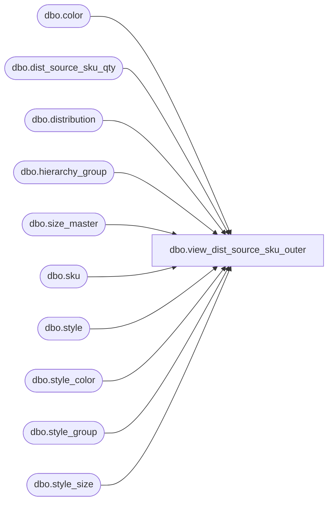

# dbo.view_dist_source_sku_outer

**Database:** me_01  
**Server:** bedrockdb02  

## Architecture Diagram



## Table Dependencies

| Referenced Table |
|---|
| dbo.color |
| dbo.dist_source_sku_qty |
| dbo.distribution |
| dbo.hierarchy_group |
| dbo.size_master |
| dbo.sku |
| dbo.style |
| dbo.style_color |
| dbo.style_group |
| dbo.style_size |

## View Code

```sql
create view dbo.view_dist_source_sku_outer 
AS
select DISTINCT d.distribution_id , ds.available_quantity, ds.reserve_quantity, ds.sku_id, h.hierarchy_group_id,h.hierarchy_group_code,
h.hierarchy_group_short_label, h.hierarchy_group_label,s.style_id, s.style_code, c.color_code,
 c.color_long_description ,c.color_short_description , sm.size_code, sm.prim_size_label,
 isnull(sm.sec_size_label,-1) sec_size_label,  s.long_desc, 
 s.short_desc
from  dist_source_sku_qty ds 
RIGHT outer join distribution d 
on d.distribution_id =ds.distribution_id 
LEFT JOIN sku sk
on ds.sku_id =sk.sku_id
LEFT JOIN style_color sc
on sk.style_color_id =sc.style_color_id
LEFT JOIN style s
on sk.style_id = s.style_id
LEFT JOIN color c 
on sc.color_id = c.color_id
LEFT JOIN style_size  ss
on sk.style_size_id = ss.style_size_id
LEFT JOIN style_group sg
on s.style_id =sg.style_id
and  sg.main_group_flag =1
LEFT JOIN size_master sm
on ss.size_master_id = sm.size_master_id
LEFT JOIN  hierarchy_group h
on sg.hierarchy_group_id = h.hierarchy_group_id
```

