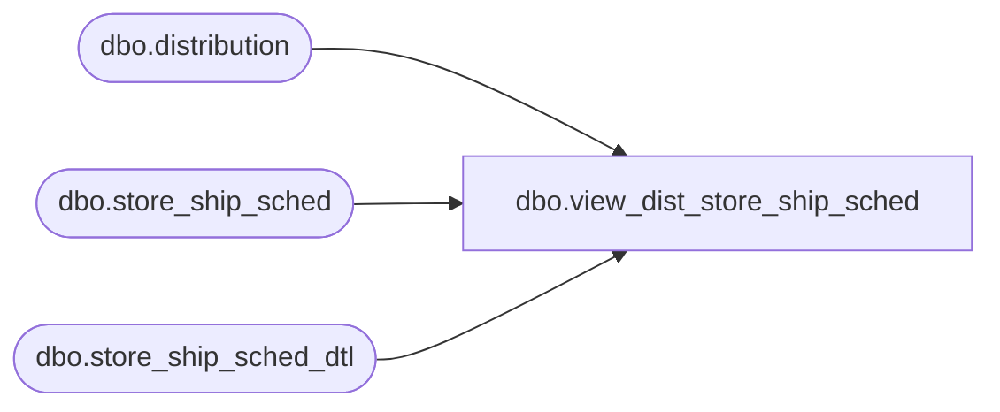

# dbo.view_dist_store_ship_sched

**Database:** me_01  
**Server:** bedrockdb02  

## Architecture Diagram



## Table Dependencies

| Referenced Table |
|---|
| dbo.distribution |
| dbo.store_ship_sched |
| dbo.store_ship_sched_dtl |

## View Code

```sql
CREATE view dbo.view_dist_store_ship_sched
AS 

SELECT d.distribution_id, sss.schedule_date
FROM distribution d  
LEFT JOIN store_ship_sched_dtl sssd 
ON d.distribution_id = sssd.distribution_id
LEFT JOIN store_ship_sched sss
ON sss.store_ship_sched_id = sssd.store_ship_sched_id
```

