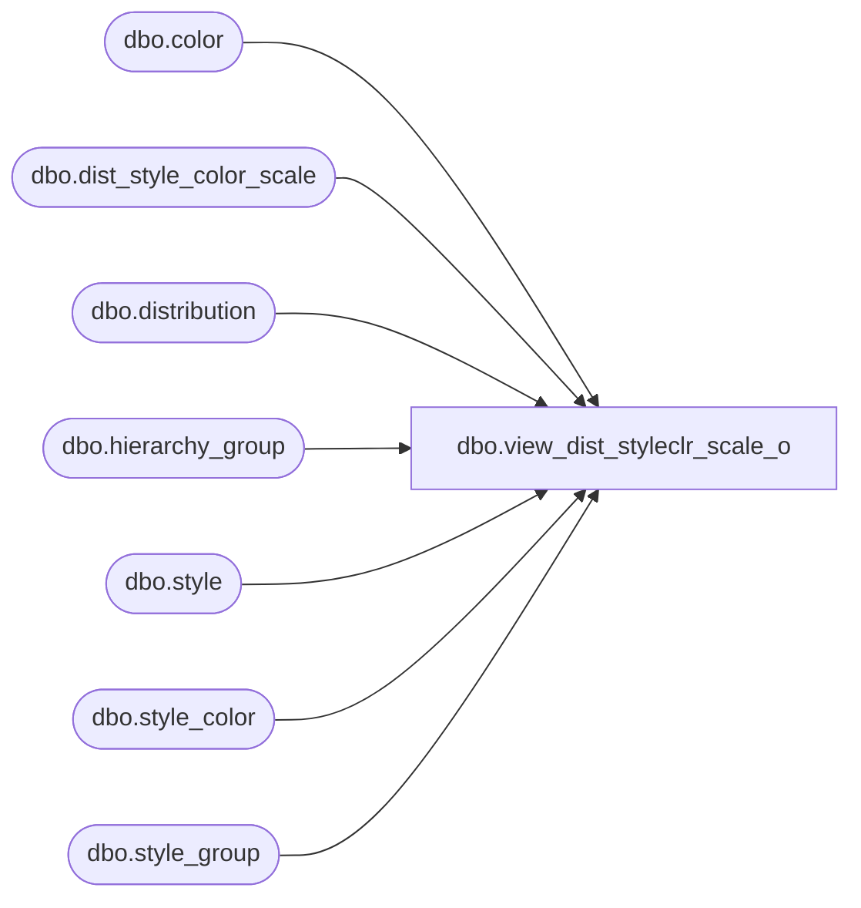

# dbo.view_dist_styleclr_scale_o

**Database:** me_01  
**Server:** bedrockdb02  

## Architecture Diagram



## Table Dependencies

| Referenced Table |
|---|
| dbo.color |
| dbo.dist_style_color_scale |
| dbo.distribution |
| dbo.hierarchy_group |
| dbo.style |
| dbo.style_color |
| dbo.style_group |

## View Code

```sql
create view dbo.view_dist_styleclr_scale_o as
select distinct  d.distribution_id ,ds.style_color_id, ds.scale_qty,
 h.hierarchy_group_id,h.hierarchy_group_code,
h.hierarchy_group_short_label, h.hierarchy_group_label, s.style_id, s.style_code, c.color_code,
 c.color_long_description ,c.color_short_description , s.long_desc,
 s.short_desc 
from   dist_style_color_scale ds
RIGHT outer join distribution d
on  ds.distribution_id = d.distribution_id
LEFT JOIN style_color sc
on ds.style_color_id =sc.style_color_id
LEFT JOIN style s
on sc.style_id = s.style_id
LEFT JOIN color c 
on sc.color_id = c.color_id
LEFT JOIN style_group sg
on s.style_id =sg.style_id
and  sg.main_group_flag =1
LEFT JOIN  hierarchy_group h
on sg.hierarchy_group_id = h.hierarchy_group_id
```

