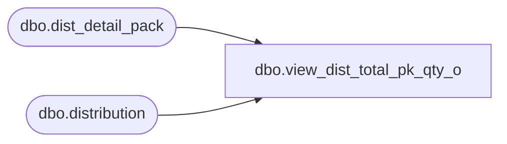

# dbo.view_dist_total_pk_qty_o

**Database:** me_01  
**Server:** bedrockdb02  

## Architecture Diagram



## Table Dependencies

| Referenced Table |
|---|
| dbo.dist_detail_pack |
| dbo.distribution |

## View Code

```sql
CREATE view dbo.view_dist_total_pk_qty_o 
AS
SELECT d.distribution_id, 
SUM(ddp.suggested_quantity) as dist_pack_sugg_qty, 
SUM(ddp.quantity) as dist_pack_disted_qty
FROM distribution d
LEFT OUTER JOIN dist_detail_pack ddp ON ddp.pack_id > 0 AND ddp.distribution_id = d.distribution_id
GROUP BY d.distribution_id
```

