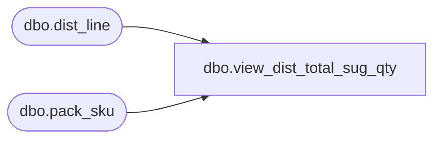

# dbo.view_dist_total_sug_qty

**Database:** me_01  
**Server:** bedrockdb02  

## Architecture Diagram



## Table Dependencies

| Referenced Table |
|---|
| dbo.dist_line |
| dbo.pack_sku |

## View Code

```sql
CREATE VIEW dbo.view_dist_total_sug_qty 
AS

SELECT distribution_id, SUM(total_suggested_qty) AS total_suggested_qty, SUM(total_distributed_qty) AS total_distributed_qty
FROM (SELECT distribution_id, dist_line_id, style_color_id, pack_id, SUM (total_suggested_detail_qty) AS total_suggested_qty, SUM (total_distributed_detail_qty) AS total_distributed_qty 
FROM dist_line
WHERE pack_id IS NULL
GROUP BY distribution_id, dist_line_id, style_color_id, pack_id
UNION 
SELECT distribution_id, dist_line_id, style_color_id, dl.pack_id, SUM (total_suggested_detail_qty * pk.pack_total_sku_qty) total_suggested_qty, SUM (total_distributed_detail_qty * pk.pack_total_sku_qty) total_distributed_qty  
FROM dist_line dl
RIGHT JOIN (SELECT pack_id, SUM(sku_quantity) AS pack_total_sku_qty FROM pack_sku
GROUP BY pack_id) pk on dl.pack_id = pk.pack_id
WHERE dl.pack_id IS NOT NULL AND dl.pack_id = pk.pack_id
GROUP BY distribution_id, dist_line_id, style_color_id, dl.pack_id) a
GROUP BY distribution_id
```

