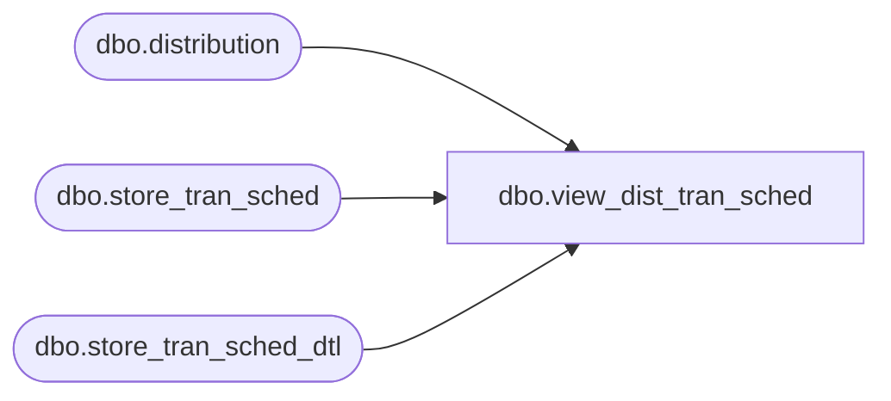

# dbo.view_dist_tran_sched

**Database:** me_01  
**Server:** bedrockdb02  

## Architecture Diagram



## Table Dependencies

| Referenced Table |
|---|
| dbo.distribution |
| dbo.store_tran_sched |
| dbo.store_tran_sched_dtl |

## View Code

```sql
CREATE view dbo.view_dist_tran_sched
AS 

SELECT d.distribution_id, sts.schedule_date
FROM distribution d  
LEFT JOIN store_tran_sched_dtl stsd 
ON d.distribution_id = stsd.distribution_id
LEFT JOIN store_tran_sched sts
ON sts.store_tran_sched_id = stsd.store_tran_sched_id
```

