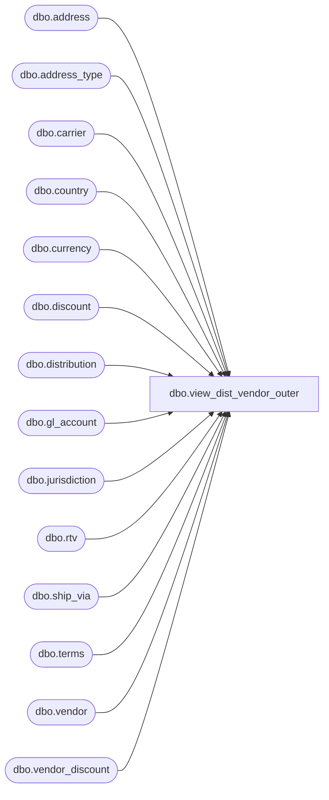

# dbo.view_dist_vendor_outer

**Database:** me_01  
**Server:** bedrockdb02  

## Architecture Diagram



## Table Dependencies

| Referenced Table |
|---|
| dbo.address |
| dbo.address_type |
| dbo.carrier |
| dbo.country |
| dbo.currency |
| dbo.discount |
| dbo.distribution |
| dbo.gl_account |
| dbo.jurisdiction |
| dbo.rtv |
| dbo.ship_via |
| dbo.terms |
| dbo.vendor |
| dbo.vendor_discount |

## View Code

```sql
create view dbo.view_dist_vendor_outer AS 
SELECT DISTINCT
   d.distribution_id,
   v.vendor_id, 
   v.vendor_code,
   v.vendor_name,
  v.alternate_vendor_code,
  v.active_flag,
  j.jurisdiction_code,
  j.jurisdiction_description,
  c.country_code,
  c.country_description,
  cu.currency_code,
  cu.currency_description,
  t.terms_description,
  v.fob_description,
  s.ship_via_description,
  ca.carrier_name,
  r.rtv_id,
  v.import_flag,
  v.rtv_acknowledgement_req_flag,
  v.requires_vendor_upc_flag,
  v.asn_auto_receive_flag,
  v.allow_customer_shipment_flag,
  v.min_on_order_cost_bulk_xdock,
  v.min_on_order_cost_dropship,
  dis.discount_code,
  dis.discount_description,
  vd.discount_value,
  gl.gl_account_no,
  gl.gl_account_description,
  vd.use_percent_for_discount_flag,
  vd.base_calculation_on,
  vd.reflect_discount_in_cost_flag,
  vd.subject_to_terms_flag,
  aty.address_type_description,
  a.address_name,
  a.address_line1,
  a.address_line2,
  a.address_city,
  a.address_state,
  a.address_zip_code,
  a.address_email,
  v.supports_store_pack
FROM distribution d
LEFT OUTER JOIN vendor v 
ON d.vendor_id = v.vendor_id
LEFT OUTER JOIN jurisdiction j
ON v.jurisdiction_id = j.jurisdiction_id
LEFT OUTER JOIN country c
ON v.country_id = c.country_id
LEFT OUTER JOIN  currency cu
ON v.currency_id =cu.currency_id
LEFT OUTER JOIN terms t
ON v.terms_id = t.terms_id
LEFT OUTER JOIN  rtv r
on v.vendor_id = r.vendor_id
LEFT OUTER JOIN ship_via s
ON v.ship_via_id = s.ship_via_id
LEFT OUTER JOIN carrier ca
ON v.carrier_id = ca.carrier_id
LEFT OUTER JOIN  vendor_discount vd
ON v.vendor_id = vd.vendor_id
LEFT OUTER JOIN discount dis
ON vd.discount_id = dis.discount_id
LEFT OUTER JOIN gl_account gl
ON vd.gl_account_id = gl.gl_account_id
LEFT OUTER JOIN address a
ON v.vendor_id = a.parent_id and a.parent_type =3
   AND address_type_id = (SELECT MIN(address_type_id) FROM address a2 WHERE a2.parent_id = v.vendor_id
							AND a2.parent_type = 3
							 )
LEFT OUTER JOIN address_type aty
ON a.address_type_id = aty.address_type_id and aty.address_type_id =1
```

