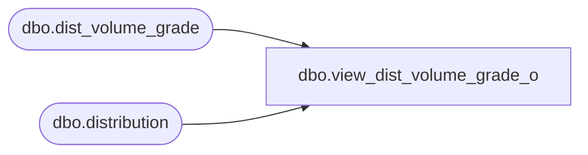

# dbo.view_dist_volume_grade_o

**Database:** me_01  
**Server:** bedrockdb02  

## Architecture Diagram



## Table Dependencies

| Referenced Table |
|---|
| dbo.dist_volume_grade |
| dbo.distribution |

## View Code

```sql
create view dbo.view_dist_volume_grade_o 
as
select distinct d.distribution_id, dv.dist_volume_grade_id,
dv.grade_code volume_grade_code,dv.sales_lower_limit,dv.minimum,dv.maximum
 from distribution d
left join dist_volume_grade dv
on d.distribution_id =dv.distribution_id
```

