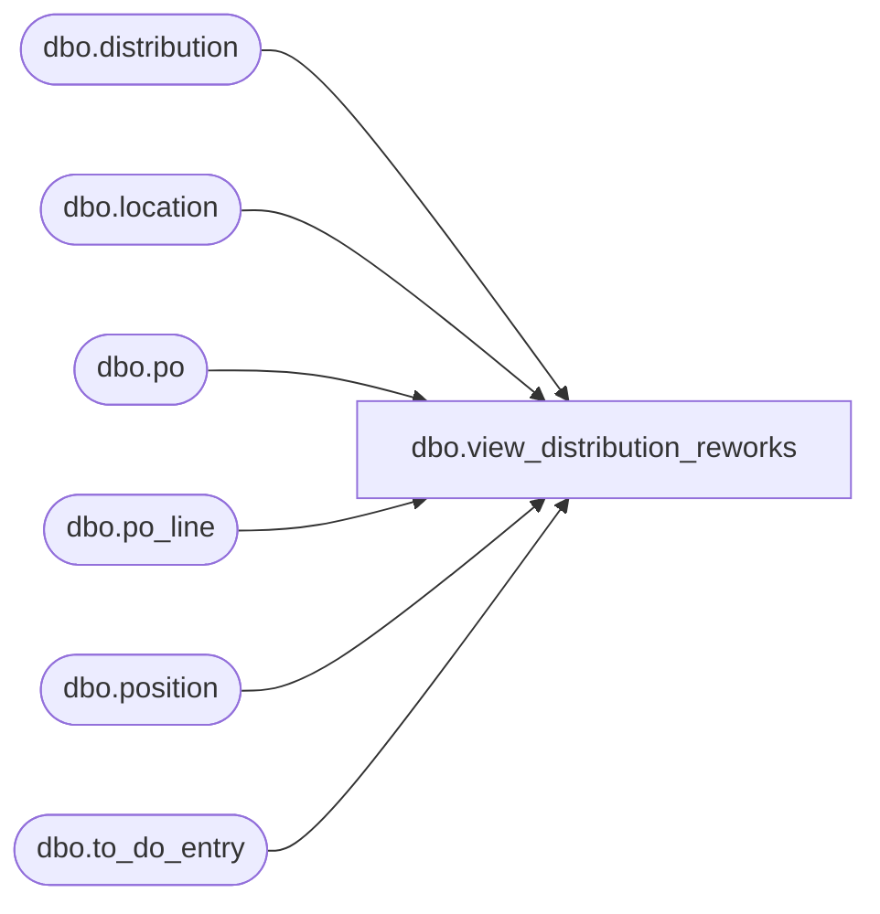

# dbo.view_distribution_reworks

**Database:** me_01  
**Server:** bedrockdb02  

## Architecture Diagram



## Table Dependencies

| Referenced Table |
|---|
| dbo.distribution |
| dbo.location |
| dbo.po |
| dbo.po_line |
| dbo.position |
| dbo.to_do_entry |

## View Code

```sql
CREATE view dbo.view_distribution_reworks 


AS

SELECT     t.to_do_entry_id, d.distribution_id, d.create_date, d.distribution_number, d.distribution_description, d.distribution_status, d.status_date, p.position_id,  p.position_code, p.position_label, 
           d.document_source,d.distribution_method, d.release_date, d.expected_receipt_date,d.po_quantities_required_flag, d.print_for_picking_flag,d.po_generated_flag,d.apply_eligibility_flag,
           d.retain_for_distribution_flag, d.keep_in_reserve, d.store_pack_definition_released, l.location_code,l.location_name,lr.location_code reserve_location_code, lr.location_name reserve_location_name,
           po.po_id, po.po_no, po.po_description, po.predistribution_type, po.po_status, po.approval_status, t.request_type, t.po_shipment_id, pl.line_no, pl.repeat_order_flag, pl.store_pack_flag
FROM         to_do_entry t INNER JOIN
                      distribution d ON t.distribution_id = d.distribution_id INNER JOIN
                      position p ON d.position_id = p.position_id LEFT OUTER JOIN
                      location l ON d.location_id = l.location_id LEFT OUTER JOIN
                      location lr ON d.reserve_location_id = lr.location_id LEFT OUTER JOIN
                      po po ON d.po_id = po.po_id
left outer join po_line pl on po.po_id = pl.po_id and pl.po_id = t.po_id and pl.po_line_id = t.po_line_id
WHERE     t.distribution_id IS NOT NULL  AND (t.locked_flag = 0 OR DATEDIFF(minute, ISNULL(t.lock_timestamp, '20140101'), getdate()) > 30 )
```

