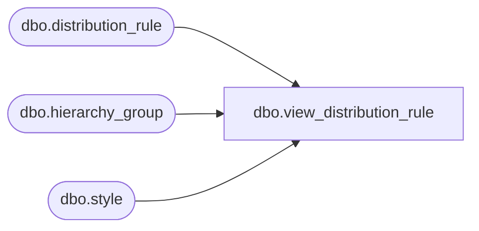

# dbo.view_distribution_rule

**Database:** me_01  
**Server:** bedrockdb02  

## Architecture Diagram



## Table Dependencies

| Referenced Table |
|---|
| dbo.distribution_rule |
| dbo.hierarchy_group |
| dbo.style |

## View Code

```sql
create view dbo.view_distribution_rule as
select dr.hierarchy_group_id,h.hierarchy_group_code, h.hierarchy_group_label,
h.hierarchy_group_short_label, NULL style_id, NULL style_code, NULL long_desc,
NULL short_desc, dr.balancing_rule,dr.order_multiple_rounding_pct,
dr.dist_multiple_rounding_pct
from distribution_rule dr
 inner join hierarchy_group h
 on dr.hierarchy_group_id = h.hierarchy_group_id
union all
select  NULL hierarchy_group_id,NULL hierarchy_group_code, NULL hierarchy_group_label,
NULL hierarchy_group_short_label, dr.style_id,s.style_code, s.long_desc,
s.short_desc,dr.balancing_rule,
dr.order_multiple_rounding_pct,dr.dist_multiple_rounding_pct
from distribution_rule dr
 inner join style s
 on dr.style_id = s.style_id
```

