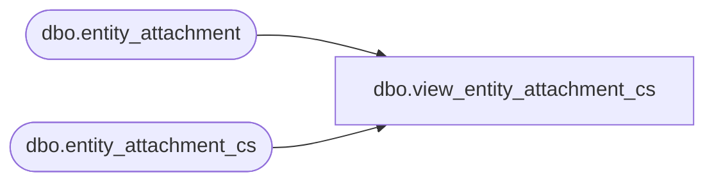

# dbo.view_entity_attachment_cs

**Database:** me_01  
**Server:** bedrockdb02  

## Architecture Diagram



## Table Dependencies

| Referenced Table |
|---|
| dbo.entity_attachment |
| dbo.entity_attachment_cs |

## View Code

```sql
create view dbo.view_entity_attachment_cs 
AS
SELECT [entity_attachment_id]
      ,[attachment_type_id]
      ,[parent_type]
      ,[parent_id]
      ,[attachment_desc]
      ,[attachment_date]
      ,[primary_flag]
      ,[url]
  FROM [entity_attachment]
UNION ALL
SELECT [entity_attachment_id]
      ,[attachment_type_id]
      ,[parent_type]
      ,[parent_id]
      ,[attachment_desc]
      ,[attachment_date]
      ,[primary_flag]
      ,[url]
  FROM [entity_attachment_cs]
```

