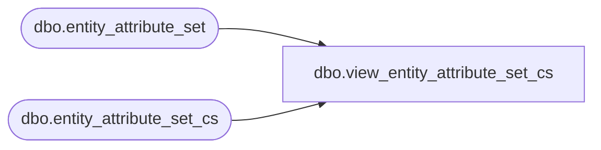

# dbo.view_entity_attribute_set_cs

**Database:** me_01  
**Server:** bedrockdb02  

## Architecture Diagram



## Table Dependencies

| Referenced Table |
|---|
| dbo.entity_attribute_set |
| dbo.entity_attribute_set_cs |

## View Code

```sql
create view dbo.view_entity_attribute_set_cs 
AS
SELECT [entity_attribute_set_id]
      ,[parent_type]
      ,[parent_id]
      ,[attribute_set_id]
      ,[attribute_id]
  FROM [entity_attribute_set]
UNION ALL
SELECT [entity_attribute_set_id]
      ,[parent_type]
      ,[parent_id]
      ,[attribute_set_id]
      ,[attribute_id]
  FROM [entity_attribute_set_cs]
```

