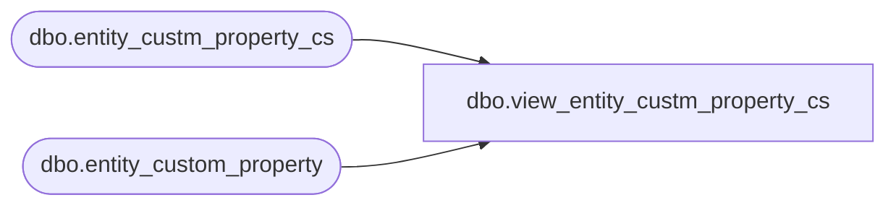

# dbo.view_entity_custm_property_cs

**Database:** me_01  
**Server:** bedrockdb02  

## Architecture Diagram



## Table Dependencies

| Referenced Table |
|---|
| dbo.entity_custm_property_cs |
| dbo.entity_custom_property |

## View Code

```sql
create view dbo.view_entity_custm_property_cs 
AS
SELECT [entity_custom_property_id]
      ,[custom_property_id]
      ,[parent_type]
      ,[parent_id]
      ,[custom_property_value]
  FROM [entity_custom_property]
UNION ALL
SELECT [entity_custom_property_id]
      ,[custom_property_id]
      ,[parent_type]
      ,[parent_id]
      ,[custom_property_value]
  FROM [entity_custm_property_cs]
```

