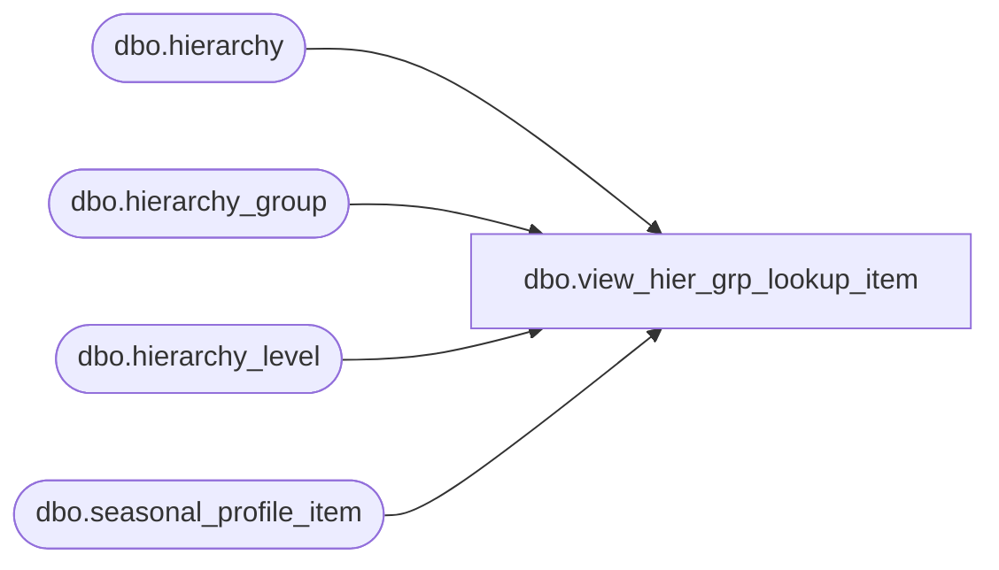

# dbo.view_hier_grp_lookup_item

**Database:** me_01  
**Server:** bedrockdb02  

## Architecture Diagram



## Table Dependencies

| Referenced Table |
|---|
| dbo.hierarchy |
| dbo.hierarchy_group |
| dbo.hierarchy_level |
| dbo.seasonal_profile_item |

## View Code

```sql
create view dbo.view_hier_grp_lookup_item AS
select distinct(h.hierarchy_group_id), h.hierarchy_group_code, h.hierarchy_group_label,
h.hierarchy_group_short_label  from  hierarchy_group h, hierarchy_level l, hierarchy y
where y.hierarchy_type = 1 and y.alternate_flag = 0 
and h.hierarchy_level_id = l.hierarchy_level_id
and h.hierarchy_group_id not in (select distinct ISNULL(hierarchy_group_id,0) from seasonal_profile_item)
```

