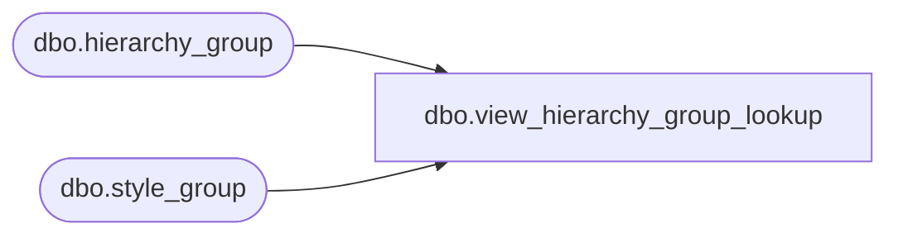

# dbo.view_hierarchy_group_lookup

**Database:** me_01  
**Server:** bedrockdb02  

## Architecture Diagram



## Table Dependencies

| Referenced Table |
|---|
| dbo.hierarchy_group |
| dbo.style_group |

## View Code

```sql
create view dbo.view_hierarchy_group_lookup AS
select distinct(sg.hierarchy_group_id), h.hierarchy_group_code, h.hierarchy_group_label,
h.hierarchy_group_short_label  from style_group sg , hierarchy_group h
where main_group_flag =1
and sg.hierarchy_group_id =h.hierarchy_group_id
```

