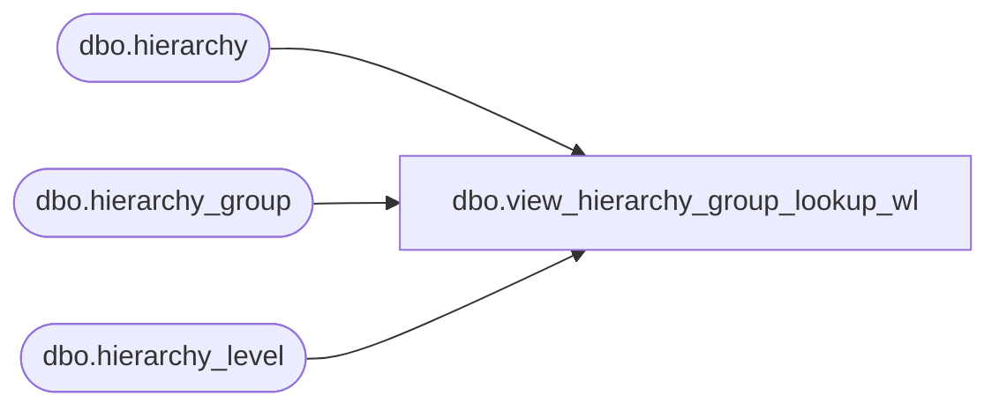

# dbo.view_hierarchy_group_lookup_wl

**Database:** me_01  
**Server:** bedrockdb02  

## Architecture Diagram



## Table Dependencies

| Referenced Table |
|---|
| dbo.hierarchy |
| dbo.hierarchy_group |
| dbo.hierarchy_level |

## View Code

```sql
create view dbo.view_hierarchy_group_lookup_wl 

AS
SELECT DISTINCT hg.hierarchy_group_id, 
		h.hierarchy_type, 
		h.hierarchy_label + N' - ' + hl.hierarchy_level_label + N' - ' + hg.hierarchy_group_label 'group_label'
FROM hierarchy h
INNER JOIN hierarchy_level hl ON (h.hierarchy_id = hl.hierarchy_id)
INNER JOIN hierarchy_group hg ON (hl.hierarchy_level_id = hg.hierarchy_level_id)
WHERE h.active_flag = 1
AND hg.active_flag = 1
```

