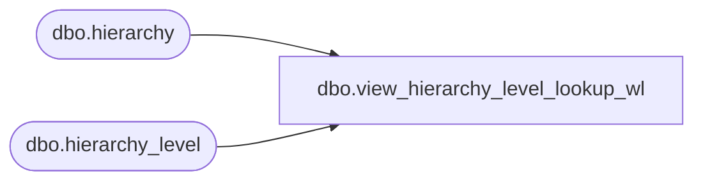

# dbo.view_hierarchy_level_lookup_wl

**Database:** me_01  
**Server:** bedrockdb02  

## Architecture Diagram



## Table Dependencies

| Referenced Table |
|---|
| dbo.hierarchy |
| dbo.hierarchy_level |

## View Code

```sql
create view dbo.view_hierarchy_level_lookup_wl 
AS
SELECT DISTINCT hl.hierarchy_level_id, 
		h.hierarchy_type, 
		h.hierarchy_label + N' - ' + hl.hierarchy_level_label 'level_label'
FROM hierarchy h
INNER JOIN hierarchy_level hl ON (h.hierarchy_id = hl.hierarchy_id)
WHERE h.active_flag = 1


dbo,view_ib_allocation,CREATE VIEW dbo.view_ib_allocation

AS

SELECT 
	ia.ib_allocation_id,
	ia.sku_id,
	k.style_id,
	ia.location_id,
	j.jurisdiction_id,
	ia.transaction_date,
	ia.expected_receipt_date,
	ia.transaction_type_code,
	ia.allocated_units,
	ia.purchase_order_number,
	ia.allocation_number
FROM ib_allocation ia
INNER JOIN sku k on ia.sku_id = k.sku_id
INNER JOIN location l ON ia.location_id = l.location_id
INNER JOIN jurisdiction j ON l.jurisdiction_id = j.jurisdiction_id
```

