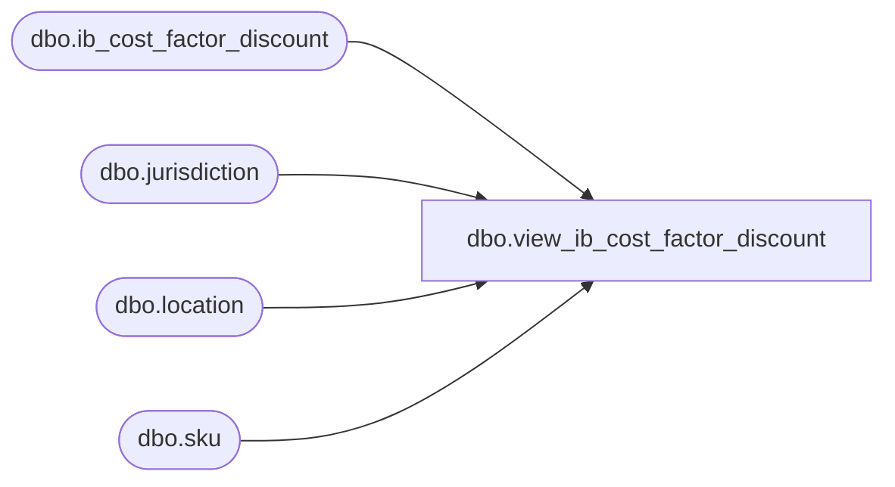

# dbo.view_ib_cost_factor_discount

**Database:** me_01  
**Server:** bedrockdb02  

## Architecture Diagram



## Table Dependencies

| Referenced Table |
|---|
| dbo.ib_cost_factor_discount |
| dbo.jurisdiction |
| dbo.location |
| dbo.sku |

## View Code

```sql
CREATE VIEW [dbo].[view_ib_cost_factor_discount]

AS

SELECT 
	ic.ib_cost_factor_discount_id,
	ic.sku_id,
	k.style_id,
	ic.location_id,
	j.jurisdiction_id,
	ic.transaction_date,
	ic.transaction_type_code,
	ic.extended_cost,
	ic.document_number,
	ic.cost_factor_discount_id,
	ic.extended_cost_local
FROM ib_cost_factor_discount ic
INNER JOIN sku k on ic.sku_id = k.sku_id
INNER JOIN location l ON ic.location_id = l.location_id
INNER JOIN jurisdiction j ON l.jurisdiction_id = j.jurisdiction_id
```

