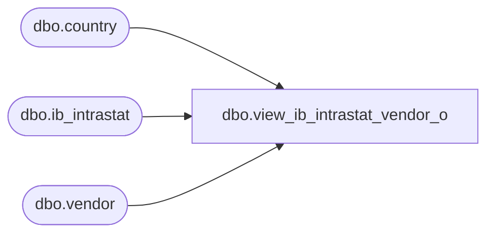

# dbo.view_ib_intrastat_vendor_o

**Database:** me_01  
**Server:** bedrockdb02  

## Architecture Diagram



## Table Dependencies

| Referenced Table |
|---|
| dbo.country |
| dbo.ib_intrastat |
| dbo.vendor |

## View Code

```sql
create view dbo.view_ib_intrastat_vendor_o AS
SELECT DISTINCT
 i.ib_intrastat_id,
 v.vendor_id, 
 v.vendor_code,
 v.vendor_name,
 v.country_id,
 c.country_code,
 c.country_description
FROM vendor v
RIGHT  OUTER JOIN ib_intrastat i
ON  i.vendor_id =v.vendor_id 
LEFT OUTER JOIN country c
on v.country_id = c.country_id


dbo,view_ib_inv_total_metadata,CREATE VIEW dbo.view_ib_inv_total_metadata
AS
SELECT ibt.sku_id, 
k.style_id, 
ibt.location_id, j.jurisdiction_id, ibt.inventory_status_id, ibt.price_status_id, ibt.total_on_hand_units, ibt.total_on_hand_cost, ibt.total_on_hand_valuation_retail, ibt.total_on_hand_selling_retail, ibt.total_on_hand_cost_local  
FROM ib_inventory_total ibt
LEFT OUTER JOIN sku k on ibt.sku_id = k.sku_id
INNER JOIN location l ON ibt.location_id = l.location_id
INNER JOIN jurisdiction j ON l.jurisdiction_id = j.jurisdiction_id


dbo,view_ib_inventory,CREATE VIEW dbo.view_ib_inventory
AS

SELECT 
	ib.ib_inventory_id,
	ib.document_number,
	ib.location_id,
	j.jurisdiction_id,
	ib.other_location_id,
	ib.price_change_type,
	ib.price_status_id,
	ib.sku_id,
	k.style_id,
	ib.inventory_status_id,
	ib.transaction_cost,
	ib.transaction_date,
	ib.transaction_valuation_retail,
	ib.transaction_selling_retail,
	ib.transaction_type_code,
	ib.transaction_units,
	ib.transaction_cost_local,
	ib.transaction_reason_id,
	coalesce(ib.transaction_no, 0) AS transaction_no,
	coalesce(ib.batch_no, 0) AS batch_no,
	coalesce(ib.register_no, 0) AS register_no
FROM ib_inventory ib
INNER JOIN sku k on ib.sku_id = k.sku_id
INNER JOIN location l ON ib.location_id = l.location_id
INNER JOIN jurisdiction j ON l.jurisdiction_id = j.jurisdiction_id
```

