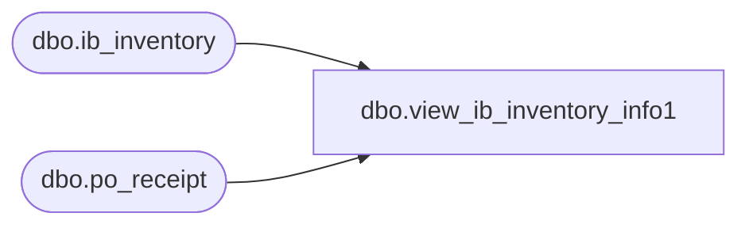

# dbo.view_ib_inventory_info1

**Database:** me_01  
**Server:** bedrockdb02  

## Architecture Diagram



## Table Dependencies

| Referenced Table |
|---|
| dbo.ib_inventory |
| dbo.po_receipt |

## View Code

```sql
create view dbo.view_ib_inventory_info1 


AS
SELECT     b.po_receipt_id,ib_i.transaction_units,ib_i.transaction_selling_retail, ib_i.sku_id
FROM         ib_inventory ib_i,
	(SELECT document_no, po_receipt_id FROM po_receipt) b
WHERE      ib_i.transaction_type_code=200
	AND b.document_no=ib_i.document_number 
	AND ib_i.document_number IS NOT NULL
GROUP BY 
ib_i.sku_id,ib_i.transaction_units,ib_i.transaction_selling_retail,b.po_receipt_id
```

