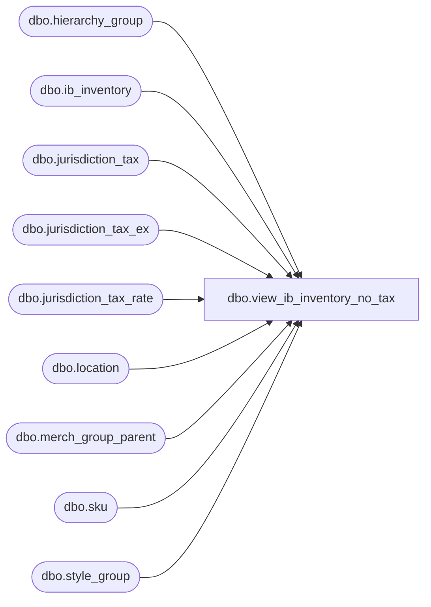

# dbo.view_ib_inventory_no_tax

**Database:** me_01  
**Server:** bedrockdb02  

## Architecture Diagram



## Table Dependencies

| Referenced Table |
|---|
| dbo.hierarchy_group |
| dbo.ib_inventory |
| dbo.jurisdiction_tax |
| dbo.jurisdiction_tax_ex |
| dbo.jurisdiction_tax_rate |
| dbo.location |
| dbo.merch_group_parent |
| dbo.sku |
| dbo.style_group |

## View Code

```sql
CREATE VIEW dbo.view_ib_inventory_no_tax
AS
SELECT	jt.ib_inventory_id,
	jt.transaction_type_code,
	CONVERT(NUMERIC(14, 2), ROUND(jt.transaction_valuation_retail / (1 + (SUM(COALESCE(ze.tax_rate, se.tax_rate, ge.tax_rate, jt.tax_rate, 0)) / 100)), 2)) AS valuation_retail_no_tax,
	CONVERT(NUMERIC(14, 2), ROUND(jt.transaction_selling_retail / (1 + (SUM(COALESCE(ze.tax_rate, se.tax_rate, ge.tax_rate, jt.tax_rate, 0)) / 100)), 2)) AS selling_retail_no_tax
FROM
	(	SELECT 	ii.ib_inventory_id,
			ii.transaction_type_code,
			transaction_valuation_retail,
			ii.transaction_selling_retail,
			jt.tax_type_id, 
			jtr.tax_rate
		FROM	ib_inventory ii
			INNER JOIN location l    
			ON (ii.location_id = l.location_id)    
			LEFT OUTER JOIN jurisdiction_tax jt    
			ON (jt.jurisdiction_id = l.jurisdiction_id
				AND jt.tax_inclusive_flag = 1
				AND jt.default_flag = 1)
			LEFT OUTER JOIN (jurisdiction_tax_rate jtr    
							INNER JOIN (SELECT jurisdiction_tax_id, MIN(effective_from_date) min_date    
										FROM jurisdiction_tax_rate    
										GROUP BY jurisdiction_tax_id) jtrm    
							ON (jtr.jurisdiction_tax_id = jtrm.jurisdiction_tax_id))    
			ON (jtr.jurisdiction_tax_id = jt.jurisdiction_tax_id    
				AND (CASE    
					WHEN ii.transaction_date < jtrm.min_date    
					THEN jtrm.min_date    
					ELSE ii.transaction_date
					END) >= jtr.effective_from_date    
				AND (ii.transaction_date <= jtr.effective_to_date OR jtr.effective_to_date IS NULL))
	)jt
	LEFT OUTER JOIN
	(	SELECT 	ii.ib_inventory_id,
			jt.tax_type_id, 
			jtr.tax_rate
		FROM	ib_inventory ii
			INNER JOIN location l    
			ON (ii.location_id = l.location_id)    
			INNER JOIN sku
			ON ii.sku_id = sku.sku_id
			INNER JOIN jurisdiction_tax_ex jte
			ON (sku.style_id = jte.style_id
				AND jte.jurisdiction_id = l.jurisdiction_id)
			INNER JOIN jurisdiction_tax jt
			ON (jt.jurisdiction_tax_id = jte.jurisdiction_tax_id
				AND jt.tax_inclusive_flag = 1)
			INNER JOIN (jurisdiction_tax_rate jtr    
					INNER JOIN (	SELECT	jurisdiction_tax_id, 
								MIN(effective_from_date) min_date    
							FROM	jurisdiction_tax_rate    
							GROUP BY jurisdiction_tax_id) jtrm    
						ON (jtr.jurisdiction_tax_id = jtrm.jurisdiction_tax_id))    
			ON (jtr.jurisdiction_tax_id = jt.jurisdiction_tax_id    
				AND (CASE    
					WHEN ii.transaction_date < jtrm.min_date    
					THEN jtrm.min_date    
					ELSE ii.transaction_date
					END) >= jtr.effective_from_date    
				AND (ii.transaction_date <= jtr.effective_to_date OR jtr.effective_to_date IS NULL))
	) se
	ON (	jt.ib_inventory_id = se.ib_inventory_id
		AND jt.tax_type_id = se.tax_type_id)
	LEFT OUTER JOIN
	(
		SELECT 	ii.ib_inventory_id,
			jt.tax_type_id, 
			jtr.tax_rate
		FROM	ib_inventory ii
			INNER JOIN location l    
			ON (ii.location_id = l.location_id)    
			INNER JOIN sku
			ON ii.sku_id = sku.sku_id
			INNER JOIN jurisdiction_tax_ex jte
			ON (sku.style_size_id = jte.style_size_id
				AND jte.jurisdiction_id = l.jurisdiction_id)
			INNER JOIN jurisdiction_tax jt
			ON (jt.jurisdiction_tax_id = jte.jurisdiction_tax_id
				AND jt.tax_inclusive_flag = 1)
			INNER JOIN (jurisdiction_tax_rate jtr    
						INNER JOIN (SELECT jurisdiction_tax_id, MIN(effective_from_date) min_date    
									FROM jurisdiction_tax_rate    
									GROUP BY jurisdiction_tax_id) jtrm    
						ON (jtr.jurisdiction_tax_id = jtrm.jurisdiction_tax_id))    
			ON (jtr.jurisdiction_tax_id = jt.jurisdiction_tax_id    
				AND (CASE    
					WHEN ii.transaction_date < jtrm.min_date    
					THEN jtrm.min_date    
					ELSE ii.transaction_date
					END) >= jtr.effective_from_date    
				AND (ii.transaction_date <= jtr.effective_to_date OR jtr.effective_to_date IS NULL))
	) ze
	ON (jt.ib_inventory_id = ze.ib_inventory_id
		AND jt.tax_type_id = ze.tax_type_id)
	LEFT OUTER JOIN
	(	SELECT 	ii.ib_inventory_id,
			jt.tax_type_id, 
			jtr.tax_rate
		FROM	ib_inventory ii
			INNER JOIN location l    
			ON (ii.location_id = l.location_id)    
			INNER JOIN sku
			ON ii.sku_id = sku.sku_id
			INNER JOIN style_group sg
			ON (sku.style_id = sg.style_id)
			INNER JOIN merch_group_parent mgp
			ON (sg.hierarchy_group_id = mgp.hierarchy_group_id)
			INNER JOIN hierarchy_group hg
			ON (mgp.parent_hierarchy_group_id = hg.hierarchy_group_id)
			INNER JOIN jurisdiction_tax_ex jte
			ON (jte.hierarchy_group_id = mgp.parent_hierarchy_group_id
				AND jte.jurisdiction_id = l.jurisdiction_id)
			INNER JOIN jurisdiction_tax jt
			ON (jt.jurisdiction_tax_id = jte.jurisdiction_tax_id
				AND jt.tax_inclusive_flag = 1)
		
				INNER JOIN (	SELECT	ii.ib_inventory_id,
							jt.tax_type_id, 
							max(hg.hierarchy_level_id) as max_hierarchy_level_id
						FROM	ib_inventory ii
							INNER JOIN location l    
							ON (ii.location_id = l.location_id)    
							INNER JOIN sku
							ON ii.sku_id = sku.sku_id
							INNER JOIN style_group sg
							ON (sku.style_id = sg.style_id)
							INNER JOIN merch_group_parent mgp
							ON (sg.hierarchy_group_id = mgp.hierarchy_group_id)
							INNER JOIN hierarchy_group hg
							ON (mgp.parent_hierarchy_group_id = hg.hierarchy_group_id)
							INNER JOIN jurisdiction_tax_ex jte
							ON (jte.hierarchy_group_id = mgp.parent_hierarchy_group_id
								AND jte.jurisdiction_id = l.jurisdiction_id)
							INNER JOIN jurisdiction_tax jt
							ON (jt.jurisdiction_tax_id = jte.jurisdiction_tax_id
								AND jt.tax_inclusive_flag = 1)
							INNER JOIN (jurisdiction_tax_rate jtr    
										INNER JOIN (	SELECT	jurisdiction_tax_id, 
													MIN(effective_from_date) min_date    
												FROM jurisdiction_tax_rate    
												GROUP BY jurisdiction_tax_id) jtrm    
										ON (jtr.jurisdiction_tax_id = jtrm.jurisdiction_tax_id))    
							ON (jtr.jurisdiction_tax_id = jt.jurisdiction_tax_id    
								AND (CASE    
									WHEN ii.transaction_date < jtrm.min_date    
									THEN jtrm.min_date    
									ELSE ii.transaction_date
									END) >= jtr.effective_from_date    
								AND (ii.transaction_date <= jtr.effective_to_date OR jtr.effective_to_date IS NULL))
						GROUP BY ii.ib_inventory_id,
							jt.tax_type_id) grmax
				ON (	ii.ib_inventory_id = grmax.ib_inventory_id
					AND jt.tax_type_id = grmax.tax_type_id
					AND hg.hierarchy_level_id = grmax.max_hierarchy_level_id)
			INNER JOIN (jurisdiction_tax_rate jtr    
						INNER JOIN (SELECT jurisdiction_tax_id, MIN(effective_from_date) min_date    
									FROM jurisdiction_tax_rate    
									GROUP BY jurisdiction_tax_id) jtrm    
						ON (jtr.jurisdiction_tax_id = jtrm.jurisdiction_tax_id))    
			ON (jtr.jurisdiction_tax_id = jt.jurisdiction_tax_id    
				AND (CASE    
					WHEN ii.transaction_date < jtrm.min_date    
					THEN jtrm.min_date    
					ELSE ii.transaction_date
					END) >= jtr.effective_from_date    
				AND (ii.transaction_date <= jtr.effective_to_date OR jtr.effective_to_date IS NULL))
	) ge
	ON (jt.ib_inventory_id = ge.ib_inventory_id
		AND jt.tax_type_id = ge.tax_type_id)
GROUP BY jt.ib_inventory_id,
	jt.transaction_type_code,
	jt.transaction_valuation_retail,
	jt.transaction_selling_retail

dbo,view_ib_inventory_outer,CREATE VIEW dbo.view_ib_inventory_outer
AS
SELECT ii.ib_inventory_id,
 ii.other_location_id,
 l.location_code other_location_code,
 l.location_name other_location_name,
 tr.transaction_reason_id,
 tr.transaction_reason_code,
 tr.transaction_reason_desc,
 pc.price_change_type_code,
 pc.abbreviation,
 pc.description,
 ii.transaction_no,
 ii.batch_no,
 ii.register_no
FROM ib_inventory ii
 LEFT OUTER JOIN transaction_reason tr ON ii.transaction_reason_id = tr.transaction_reason_id
 LEFT OUTER JOIN price_change_type pc ON ii.price_change_type = pc.price_change_type_code
 LEFT OUTER JOIN location l ON ii.other_location_id = l.location_id
```

