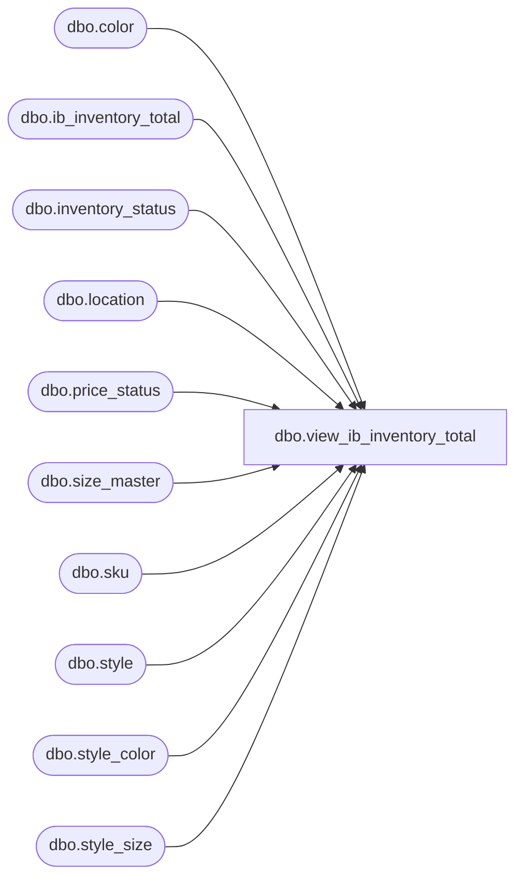

# dbo.view_ib_inventory_total

**Database:** me_01  
**Server:** bedrockdb02  

## Architecture Diagram



## Table Dependencies

| Referenced Table |
|---|
| dbo.color |
| dbo.ib_inventory_total |
| dbo.inventory_status |
| dbo.location |
| dbo.price_status |
| dbo.size_master |
| dbo.sku |
| dbo.style |
| dbo.style_color |
| dbo.style_size |

## View Code

```sql
CREATE VIEW dbo.view_ib_inventory_total
AS
SELECT s.style_code AS style_code
	, s.long_desc AS style_long_description
	, c.color_code AS color_code
	, sc.long_desc AS style_color_long_description
	, sm.size_code AS size_code
	, l.location_code AS location_code
	, l.location_name AS location_name
	, invstat.inventory_status_code AS inventory_status_code
	, invstat.inventory_status_desc AS inventory_status_description
	, ps.price_status_code AS price_status_code
	, ps.price_status_desc AS price_status_description
	, it.total_on_hand_units AS total_on_hand_units
	, it.total_on_hand_cost AS total_on_hand_cost
	, it.total_on_hand_cost_local AS total_on_hand_local_cost
	, it.total_on_hand_valuation_retail AS total_on_hand_valuation_retail
	, it.total_on_hand_selling_retail AS total_on_hand_selling_retail
FROM ib_inventory_total it
	 LEFT JOIN sku ON it.sku_id = sku.sku_id
	 LEFT JOIN style AS s ON sku.style_id = s.style_id
	 LEFT JOIN style_color AS sc ON sku.style_color_id = sc.style_color_id
	 LEFT JOIN color AS c ON sc.color_id = c.color_id
	 LEFT JOIN style_size AS ss ON sku.style_size_id = ss.style_size_id
	 LEFT JOIN size_master AS sm ON ss.size_master_id = sm.size_master_id
	 LEFT JOIN location AS l ON it.location_id = l.location_id
	 LEFT JOIN inventory_status AS invStat ON it.inventory_status_id = invStat.inventory_status_id
	 LEFT JOIN price_status AS ps ON it.price_status_id = ps.price_status_id

dbo,view_ib_on_order,CREATE VIEW dbo.view_ib_on_order
AS

SELECT
	ibo.ib_on_order_id,
	ibo.on_order_cost,
	ibo.on_order_cost_local,
	ibo.document_number,
	ibo.po_id,
	ibo.po_shipment_id,
	ibo.location_id,
	j.jurisdiction_id,
	ibo.price_status_id,
	ibo.receipt_date,
	ibo.on_order_valuation_retail,
	ibo.on_order_selling_retail,
	ibo.sku_id,
	k.style_id,
	ibo.transaction_type_code,
	ibo.on_order_units
FROM ib_on_order ibo
INNER JOIN sku k on ibo.sku_id = k.sku_id
INNER JOIN location l ON ibo.location_id = l.location_id
INNER JOIN jurisdiction j ON l.jurisdiction_id = j.jurisdiction_id
```

