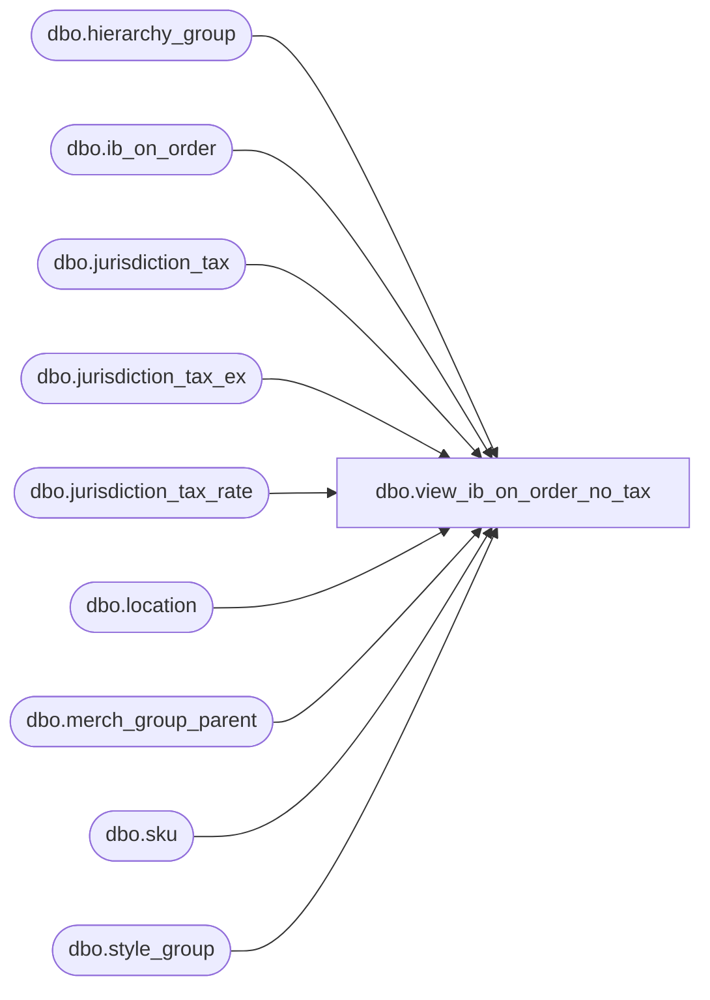

# dbo.view_ib_on_order_no_tax

**Database:** me_01  
**Server:** bedrockdb02  

## Architecture Diagram



## Table Dependencies

| Referenced Table |
|---|
| dbo.hierarchy_group |
| dbo.ib_on_order |
| dbo.jurisdiction_tax |
| dbo.jurisdiction_tax_ex |
| dbo.jurisdiction_tax_rate |
| dbo.location |
| dbo.merch_group_parent |
| dbo.sku |
| dbo.style_group |

## View Code

```sql
CREATE VIEW dbo.view_ib_on_order_no_tax
AS
SELECT	jt.ib_on_order_id,
	jt.transaction_type_code,
	CONVERT(NUMERIC(14, 2), ROUND(jt.on_order_valuation_retail / (1 + (SUM(COALESCE(ze.tax_rate, se.tax_rate, ge.tax_rate, jt.tax_rate, 0)) / 100)), 2)) AS valuation_retail_no_tax,
	CONVERT(NUMERIC(14, 2), ROUND(jt.on_order_selling_retail / (1 + (SUM(COALESCE(ze.tax_rate, se.tax_rate, ge.tax_rate, jt.tax_rate, 0)) / 100)), 2)) AS selling_retail_no_tax
FROM
	(	SELECT 	ii.ib_on_order_id,
			ii.transaction_type_code,
			ii.on_order_valuation_retail,
			ii.on_order_selling_retail,
			jt.tax_type_id, 
			jtr.tax_rate
		FROM	ib_on_order ii
			INNER JOIN location l    
			ON (ii.location_id = l.location_id)    
			LEFT OUTER JOIN jurisdiction_tax jt    
			ON (jt.jurisdiction_id = l.jurisdiction_id
				AND jt.tax_inclusive_flag = 1
				AND jt.default_flag = 1)
			LEFT OUTER JOIN (jurisdiction_tax_rate jtr    
							INNER JOIN (SELECT jurisdiction_tax_id, MIN(effective_from_date) min_date    
										FROM jurisdiction_tax_rate    
										GROUP BY jurisdiction_tax_id) jtrm    
							ON (jtr.jurisdiction_tax_id = jtrm.jurisdiction_tax_id))    
			ON (jtr.jurisdiction_tax_id = jt.jurisdiction_tax_id    
				AND (CASE    
					WHEN ii.receipt_date < jtrm.min_date    
					THEN jtrm.min_date    
					ELSE ii.receipt_date
					END) >= jtr.effective_from_date    
				AND (ii.receipt_date <= jtr.effective_to_date OR jtr.effective_to_date IS NULL))
	)jt
	LEFT OUTER JOIN
	(	SELECT 	ii.ib_on_order_id,
			jt.tax_type_id, 
			jtr.tax_rate
		FROM	ib_on_order ii
			INNER JOIN location l    
			ON (ii.location_id = l.location_id)    
			INNER JOIN sku
			ON ii.sku_id = sku.sku_id
			INNER JOIN jurisdiction_tax_ex jte
			ON (sku.style_id = jte.style_id
				AND jte.jurisdiction_id = l.jurisdiction_id)
			INNER JOIN jurisdiction_tax jt
			ON (jt.jurisdiction_tax_id = jte.jurisdiction_tax_id
				AND jt.tax_inclusive_flag = 1)
			INNER JOIN (jurisdiction_tax_rate jtr    
					INNER JOIN (	SELECT	jurisdiction_tax_id, 
								MIN(effective_from_date) min_date    
							FROM	jurisdiction_tax_rate    
							GROUP BY jurisdiction_tax_id) jtrm    
						ON (jtr.jurisdiction_tax_id = jtrm.jurisdiction_tax_id))    
			ON (jtr.jurisdiction_tax_id = jt.jurisdiction_tax_id    
				AND (CASE    
					WHEN ii.receipt_date < jtrm.min_date    
					THEN jtrm.min_date    
					ELSE ii.receipt_date
					END) >= jtr.effective_from_date    
				AND (ii.receipt_date <= jtr.effective_to_date OR jtr.effective_to_date IS NULL))
	) se
	ON (	jt.ib_on_order_id = se.ib_on_order_id
		AND jt.tax_type_id = se.tax_type_id)
	LEFT OUTER JOIN
	(
		SELECT 	ii.ib_on_order_id,
			jt.tax_type_id, 
			jtr.tax_rate
		FROM	ib_on_order ii
			INNER JOIN location l    
			ON (ii.location_id = l.location_id)    
			INNER JOIN sku
			ON ii.sku_id = sku.sku_id
			INNER JOIN jurisdiction_tax_ex jte
			ON (sku.style_size_id = jte.style_size_id
				AND jte.jurisdiction_id = l.jurisdiction_id)
			INNER JOIN jurisdiction_tax jt
			ON (jt.jurisdiction_tax_id = jte.jurisdiction_tax_id
				AND jt.tax_inclusive_flag = 1)
			INNER JOIN (jurisdiction_tax_rate jtr    
						INNER JOIN (SELECT jurisdiction_tax_id, MIN(effective_from_date) min_date    
									FROM jurisdiction_tax_rate    
									GROUP BY jurisdiction_tax_id) jtrm    
						ON (jtr.jurisdiction_tax_id = jtrm.jurisdiction_tax_id))    
			ON (jtr.jurisdiction_tax_id = jt.jurisdiction_tax_id    
				AND (CASE    
					WHEN ii.receipt_date < jtrm.min_date    
					THEN jtrm.min_date    
					ELSE ii.receipt_date
					END) >= jtr.effective_from_date    
				AND (ii.receipt_date <= jtr.effective_to_date OR jtr.effective_to_date IS NULL))
	) ze
	ON (jt.ib_on_order_id = ze.ib_on_order_id
		AND jt.tax_type_id = ze.tax_type_id)
	LEFT OUTER JOIN
	(	SELECT 	ii.ib_on_order_id,
			jt.tax_type_id, 
			jtr.tax_rate
		FROM	ib_on_order ii
			INNER JOIN location l    
			ON (ii.location_id = l.location_id)    
			INNER JOIN sku
			ON ii.sku_id = sku.sku_id
			INNER JOIN style_group sg
			ON (sku.style_id = sg.style_id)
			INNER JOIN merch_group_parent mgp
			ON (sg.hierarchy_group_id = mgp.hierarchy_group_id)
			INNER JOIN hierarchy_group hg
			ON (mgp.parent_hierarchy_group_id = hg.hierarchy_group_id)
			INNER JOIN jurisdiction_tax_ex jte
			ON (jte.hierarchy_group_id = mgp.parent_hierarchy_group_id
				AND jte.jurisdiction_id = l.jurisdiction_id)
			INNER JOIN jurisdiction_tax jt
			ON (jt.jurisdiction_tax_id = jte.jurisdiction_tax_id
				AND jt.tax_inclusive_flag = 1)
		
				INNER JOIN (	SELECT	ii.ib_on_order_id,
							jt.tax_type_id, 
							max(hg.hierarchy_level_id) as max_hierarchy_level_id
						FROM	ib_on_order ii
							INNER JOIN location l    
							ON (ii.location_id = l.location_id)    
							INNER JOIN sku
							ON ii.sku_id = sku.sku_id
							INNER JOIN style_group sg
							ON (sku.style_id = sg.style_id)
							INNER JOIN merch_group_parent mgp
							ON (sg.hierarchy_group_id = mgp.hierarchy_group_id)
							INNER JOIN hierarchy_group hg
							ON (mgp.parent_hierarchy_group_id = hg.hierarchy_group_id)
							INNER JOIN jurisdiction_tax_ex jte
							ON (jte.hierarchy_group_id = mgp.parent_hierarchy_group_id
								AND jte.jurisdiction_id = l.jurisdiction_id)
							INNER JOIN jurisdiction_tax jt
							ON (jt.jurisdiction_tax_id = jte.jurisdiction_tax_id
								AND jt.tax_inclusive_flag = 1)
							INNER JOIN (jurisdiction_tax_rate jtr    
										INNER JOIN (	SELECT	jurisdiction_tax_id, 
													MIN(effective_from_date) min_date    
												FROM jurisdiction_tax_rate    
												GROUP BY jurisdiction_tax_id) jtrm    
										ON (jtr.jurisdiction_tax_id = jtrm.jurisdiction_tax_id))    
							ON (jtr.jurisdiction_tax_id = jt.jurisdiction_tax_id    
								AND (CASE    
									WHEN ii.receipt_date < jtrm.min_date    
									THEN jtrm.min_date    
									ELSE ii.receipt_date
									END) >= jtr.effective_from_date    
								AND (ii.receipt_date <= jtr.effective_to_date OR jtr.effective_to_date IS NULL))
						GROUP BY ii.ib_on_order_id,
							jt.tax_type_id) grmax
				ON (	ii.ib_on_order_id = grmax.ib_on_order_id
					AND jt.tax_type_id = grmax.tax_type_id
					AND hg.hierarchy_level_id = grmax.max_hierarchy_level_id)
			INNER JOIN (jurisdiction_tax_rate jtr    
						INNER JOIN (SELECT jurisdiction_tax_id, MIN(effective_from_date) min_date    
									FROM jurisdiction_tax_rate    
									GROUP BY jurisdiction_tax_id) jtrm    
						ON (jtr.jurisdiction_tax_id = jtrm.jurisdiction_tax_id))    
			ON (jtr.jurisdiction_tax_id = jt.jurisdiction_tax_id    
				AND (CASE    
					WHEN ii.receipt_date < jtrm.min_date    
					THEN jtrm.min_date    
					ELSE ii.receipt_date
					END) >= jtr.effective_from_date    
				AND (ii.receipt_date <= jtr.effective_to_date OR jtr.effective_to_date IS NULL))
	) ge
	ON (jt.ib_on_order_id = ge.ib_on_order_id
		AND jt.tax_type_id = ge.tax_type_id)
GROUP BY jt.ib_on_order_id,
	jt.transaction_type_code,
	jt.on_order_valuation_retail,
	jt.on_order_selling_retail

dbo,view_ib_on_order_total,CREATE VIEW dbo.view_ib_on_order_total

AS

SELECT 
	ibot.document_number,
	ibot.sku_id,
	k.style_id,
	ibot.location_id,
	j.jurisdiction_id,
	ibot.receipt_date,
	ibot.price_status_id,
	ibot.total_on_order_units,
	ibot.total_on_order_cost,
	ibot.total_on_order_cost_local,
	ibot.total_on_order_selling_retail,
	ibot.total_on_order_val_retail
FROM ib_on_order_total ibot
INNER JOIN sku k on ibot.sku_id = k.sku_id
INNER JOIN location l ON ibot.location_id = l.location_id
INNER JOIN jurisdiction j ON l.jurisdiction_id = j.jurisdiction_id

dbo,view_ib_price_outer,CREATE VIEW dbo.view_ib_price_outer
AS

SELECT ibpc.ib_price_id, coalesce(ibpc.color_id, 0) color_id, c.color_code, c.color_short_description, c.color_long_description, coalesce(ibpc.location_id, 0) location_id, l.location_code, l.location_name, coalesce(ibpc.pricing_group_id, 0) pricing_group_id, pg.pricing_group_code, pg.pricing_group_description, coalesce(ibpc.style_color_id, 0) style_color_id, sc.short_desc, sc.long_desc, coalesce(ibpc.sku_id, 0) sku_id, coalesce(sm.size_master_id,0) size_master_id, sm.size_code, sz.style_size_id
FROM ib_price ibpc
LEFT OUTER JOIN color c ON c.color_id = ibpc.color_id
LEFT OUTER JOIN location l ON l.location_id = ibpc.location_id
LEFT OUTER JOIN pricing_group pg ON pg.pricing_group_id = ibpc.pricing_group_id
LEFT OUTER JOIN style_color sc ON sc.style_color_id = ibpc.style_color_id
LEFT OUTER JOIN sku k ON k.sku_id = ibpc.sku_id
LEFT JOIN style_size sz ON sz.style_size_id = k.style_size_id
LEFT JOIN size_master sm ON sm.size_master_id = sz.size_master_id

dbo,view_ib_transactions,create view dbo.view_ib_transactions 
AS 
  SELECT ib_inventory_id ib_id,
	 sku_id,
	 location_id,
	 transaction_date,
	 transaction_type_code,
	 transaction_units,
	 transaction_cost,
	 transaction_cost_local,
	 transaction_valuation_retail,
	 transaction_selling_retail,
	 document_number,
	 price_status_id,
	 inventory_status_id,
	 other_location_id,
	 transaction_reason_id,
	 price_change_type,
	 NULL cost_factor_discount_id,
	 1 as source_type,
	 transaction_no,
	 batch_no,
	 register_no
  FROM dbo.ib_inventory
  UNION ALL
  SELECT ib_cost_factor_discount_id,
	 sku_id,
	 location_id,
	 transaction_date,
	 transaction_type_code,
	 0,
	 extended_cost,
	 extended_cost_local,
	 0,
	 0,
	 document_number,
	 NULL,
	 NULL,
	 NULL,
	 NULL,
	 NULL,
	 cost_factor_discount_id,
	 2 as source_type,
	 NULL,
	 NULL,
	 NULL
  FROM dbo.ib_cost_factor_discount 
  UNION ALL
  SELECT ib_on_order_id,
	 sku_id,
	 location_id,
	 receipt_date,
	 transaction_type_code, 
	 on_order_units,
	 on_order_cost,
	 on_order_cost_local,
	 on_order_valuation_retail,
	 on_order_selling_retail,
	 document_number,
	 price_status_id,
	 NULL,
	 NULL,
	 NULL,
	 NULL,
	 NULL,
	 3 as source_type,
	 NULL,
	 NULL,
	 NULL
  FROM dbo.ib_on_order
  UNION ALL
  SELECT ib_allocation_id,
	 sku_id,
	 location_id,
	 expected_receipt_date,
	 transaction_type_code,
	 allocated_units,
	 0,
	 0,
	 0,
	 0,
	 allocation_number,
	 NULL,
	 NULL,
	 NULL,
	 NULL,
	 NULL,
	 NULL,
	 4 as source_type,
	 NULL,
	 NULL,
	 NULL
  FROM dbo.ib_allocation
```

