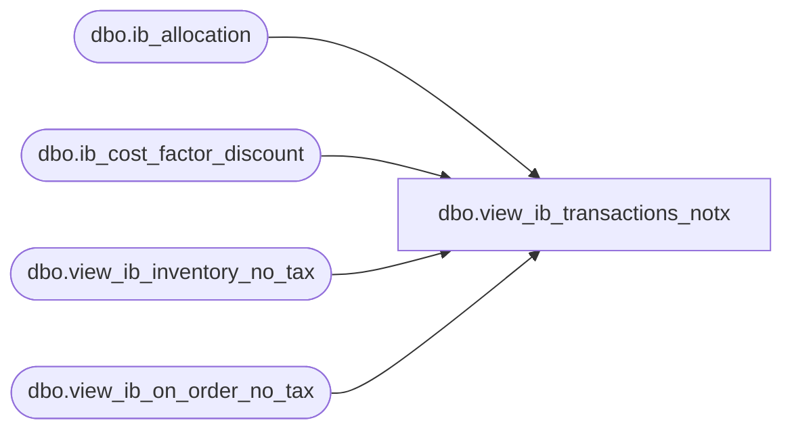

# dbo.view_ib_transactions_notx

**Database:** me_01  
**Server:** bedrockdb02  

## Architecture Diagram



## Table Dependencies

| Referenced Table |
|---|
| dbo.ib_allocation |
| dbo.ib_cost_factor_discount |
| dbo.view_ib_inventory_no_tax |
| dbo.view_ib_on_order_no_tax |

## View Code

```sql
create view dbo.view_ib_transactions_notx 


AS	

SELECT	ib_inventory_id ib_id,
	transaction_type_code,
	valuation_retail_no_tax,
	selling_retail_no_tax,
	1 as source_type
FROM	view_ib_inventory_no_tax

UNION ALL

SELECT	ib_cost_factor_discount_id,
	transaction_type_code,
	0,
	0,
	2 as source_type
FROM	dbo.ib_cost_factor_discount 

UNION ALL

SELECT	ib_on_order_id,
	transaction_type_code,
	valuation_retail_no_tax,
	selling_retail_no_tax,
	3 as source_type
FROM	view_ib_on_order_no_tax

UNION ALL

SELECT	ib_allocation_id,
	transaction_type_code,
	0,
	0,
	4 as source_type
FROM dbo.ib_allocation
```

