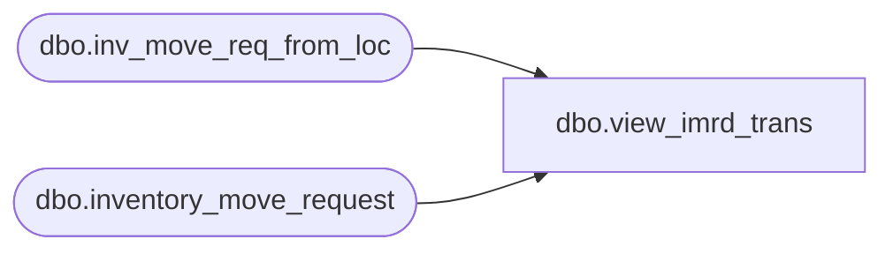

# dbo.view_imrd_trans

**Database:** me_01  
**Server:** bedrockdb02  

## Architecture Diagram



## Table Dependencies

| Referenced Table |
|---|
| dbo.inv_move_req_from_loc |
| dbo.inventory_move_request |

## View Code

```sql
create view dbo.view_imrd_trans 

	(doc_type,
	 doc_no,
 	 from_location_id,
 	 to_location_id,
	 create_date,
	 receive_date,
 	 status,
	 description,
	 doc_id,
	 display_location_id,
	 grouping_label,
	 secondary_type,
	 vendor_code,
	 vendor_name,
	 transaction_reason_id,
	 packed_by,
	 ship_date,
	 print_flag,
         match_status,
         po_no,
         document_source,
         inv_move_req_from_loc_id)
AS
SELECT	N'IMRD-TRANS',
         inventory_move_request.document_no,
	 inv_move_req_from_loc.location_id,
	 inventory_move_request.to_location_id,
	 convert(smalldatetime,convert(char(12),inventory_move_request.create_date,109)),
	convert(smalldatetime,convert(char(12),inventory_move_request.begin_send_date,109)),
	inventory_move_request.document_status,
	inventory_move_request.document_description,
	inventory_move_request.inventory_move_request_id,
	CAST(null AS smallint),
	inventory_move_request.grouping_label,
	inventory_move_request.document_type,
        CAST(null AS nvarchar(20)),
	CAST(null AS nvarchar(50)),
	inventory_move_request.transaction_reason_id,
	CAST(null AS nvarchar(60)),
	CAST(null AS smalldatetime),
	inv_move_req_from_loc.print_flag,
        CAST(null AS smallint),
        CAST(null AS nvarchar(20)),
        inventory_move_request.document_source,
        inv_move_req_from_loc.inv_move_req_from_loc_id
FROM dbo.inv_move_req_from_loc,dbo.inventory_move_request
WHERE inventory_move_request.inventory_move_request_id = inv_move_req_from_loc.inventory_move_request_id
AND inventory_move_request.document_type = 2
```

