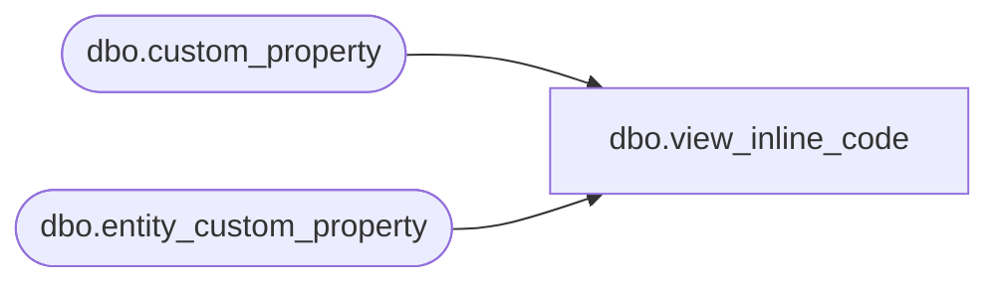

# dbo.view_inline_code

**Database:** me_01  
**Server:** bedrockdb02  

## Architecture Diagram



## Table Dependencies

| Referenced Table |
|---|
| dbo.custom_property |
| dbo.entity_custom_property |

## View Code

```sql
create view [dbo].[view_inline_code] AS

SELECT parent_id style_id, CAST(custom_property_value AS VARCHAR(30)) inline_code FROM entity_custom_property ecp with (nolock)
 INNER JOIN custom_property cp with (nolock) ON ecp.custom_property_id = cp.custom_property_id  WHERE cust_prop_code = 'INLINE'
```

