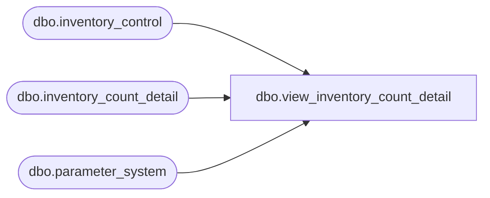

# dbo.view_inventory_count_detail

**Database:** me_01  
**Server:** bedrockdb02  

## Architecture Diagram



## Table Dependencies

| Referenced Table |
|---|
| dbo.inventory_control |
| dbo.inventory_count_detail |
| dbo.parameter_system |

## View Code

```sql
-- 4.3.3 version

CREATE view [dbo].[view_inventory_count_detail] AS
SELECT
	sku_id, c.pack_id
	, c.inventory_control_id, inventory_control_loc_id
	, c.total_oh_book_cost as book_cost
		, c.total_oh_book_cost_local as book_cost_local
	, ISNULL(c.total_oh_book_val_retail, 0) as book_retail,
         ISNULL(c.total_oh_book_sell_retail, 0) as book_retail_local
	, c.total_oh_book_units as book_units
	, ISNULL(c.total_cost, (c.units_counted * CASE WHEN (h.update_type = 3 AND c.cost IS NOT NULL) THEN c.cost ELSE c.average_cost END)) as counted_cost
		, ISNULL(c.total_cost_local, (c.units_counted * CASE WHEN (h.update_type = 3 AND c.cost_local IS NOT NULL) THEN c.cost_local ELSE c.average_cost_local END)) as counted_cost_local
	, ISNULL(c.total_valuation_retail, (c.units_counted * c.valuation_unit_retail)) as counted_retail
		, ISNULL(c.total_retail, (c.units_counted * c.selling_unit_retail)) as counted_retail_local
	, c.units_counted as counted_units
	, ISNULL(c.total_cost, (c.extended_units_counted * CASE WHEN (h.update_type = 3 AND c.cost IS NOT NULL) THEN c.cost ELSE c.average_cost END)) as extended_counted_cost
		, ISNULL(c.total_cost_local, (c.extended_units_counted * CASE WHEN (h.update_type = 3 AND c.cost_local IS NOT NULL) THEN c.cost_local ELSE c.average_cost_local END)) as extended_counted_cost_local
	, ISNULL(c.total_valuation_retail,(c.extended_units_counted * c.valuation_unit_retail)) as extended_counted_retail
		, ISNULL(c.total_retail,(c.extended_units_counted * c.selling_unit_retail)) as extended_counted_retail_local
	, c.extended_units_counted as extended_counted_units
	, -c.pack_shrink_units as final_pack_shrink_units
	, -c.shrink_cost as final_shrink_cost
		, -c.shrink_cost_local as final_shrink_cost_local
	, -c.shrink_valuation_retail as final_shrink_retail
		, -c.shrink_selling_retail as final_shrink_retail_local
	, -c.shrink_units as final_shrink_units
	, c.total_oh_in_transit_cost as in_transit_cost
		, c.total_oh_in_transit_cost_local as in_transit_cost_local
	, ISNULL(c.total_oh_in_transit_units, 0) * ISNULL(c.valuation_unit_retail, 0) as in_transit_retail
		, ISNULL(c.total_oh_in_transit_units, 0) * ISNULL(c.selling_unit_retail, 0) as in_transit_retail_local
	, c.total_oh_in_transit_units as in_transit_units
	, c.book_pack_units as pack_book_units
	, c.units_counted as pack_counted_units
	, ISNULL(c.book_pack_units, 0) - ISNULL(c.units_counted, 0) as prelim_pack_shrink_units
	, CASE
			WHEN ib_average_cost_location_level = 1
 	      THEN
				CASE
					WHEN c.cost IS NOT NULL
					THEN ISNULL(c.total_oh_book_cost, 0) - cost
				ELSE
					((ISNULL(c.total_oh_in_transit_cost, 0) + ISNULL(c.total_oh_book_cost, 0)) - (ISNULL(c.total_oh_in_transit_units, 0) + ISNULL(c.extended_units_counted, 0)) * ISNULL(c.average_cost, 0))
				END
	  ELSE
			CASE
				WHEN c.cost IS NOT NULL
				THEN ISNULL(c.total_oh_book_cost, 0) - cost
			ELSE
				ISNULL(c.total_oh_book_cost - cost, (ISNULL(c.total_oh_book_units, 0) - ISNULL(c.extended_units_counted, 0))  * ISNULL(c.average_cost, 0))
			END
	  END as prelim_shrink_cost
		, CASE
				WHEN ib_average_cost_location_level = 1
 				THEN
					CASE
						WHEN c.cost_local IS NOT NULL
						THEN ISNULL(c.total_oh_book_cost_local, 0) - cost_local
					ELSE
						((ISNULL(c.total_oh_in_transit_cost_local, 0) + ISNULL(c.total_oh_book_cost_local, 0)) - (ISNULL(c.total_oh_in_transit_units, 0) + ISNULL(c.extended_units_counted, 0)) * ISNULL(c.average_cost_local, 0))
					END
		  ELSE
				CASE
					WHEN c.cost_local IS NOT NULL
					THEN ISNULL(c.total_oh_book_cost_local, 0) - cost_local
				ELSE
					ISNULL(c.total_oh_book_cost_local - cost_local, (ISNULL(c.total_oh_book_units, 0) - ISNULL(c.extended_units_counted, 0))  * ISNULL(c.average_cost_local, 0))
				END
		  END as prelim_shrink_cost_local
	, CASE
			WHEN total_valuation_retail IS NULL
			THEN (ISNULL(c.total_oh_book_units, 0) * ISNULL(c.valuation_unit_retail, 0)) - (ISNULL(c.extended_units_counted, 0) * ISNULL(c.valuation_unit_retail, 0))
	  ELSE
         ISNULL(total_oh_book_val_retail, 0) - ISNULL(total_valuation_retail, 0)
	  END as prelim_shrink_retail
		, CASE
				WHEN total_retail IS NULL
				THEN (ISNULL(c.total_oh_book_units, 0) * ISNULL(c.selling_unit_retail, 0)) - (ISNULL(c.extended_units_counted, 0) * ISNULL(c.selling_unit_retail, 0))
		  ELSE
				ISNULL(total_oh_book_sell_retail, 0) - ISNULL(total_retail, 0)
		  END as prelim_shrink_retail_local
	, ISNULL(c.total_oh_book_units, 0) - ISNULL(c.extended_units_counted, 0) as prelim_shrink_units
FROM
	dbo.inventory_count_detail c
CROSS JOIN dbo.parameter_system
INNER JOIN inventory_control h ON c.inventory_control_id = h.inventory_control_id
```

