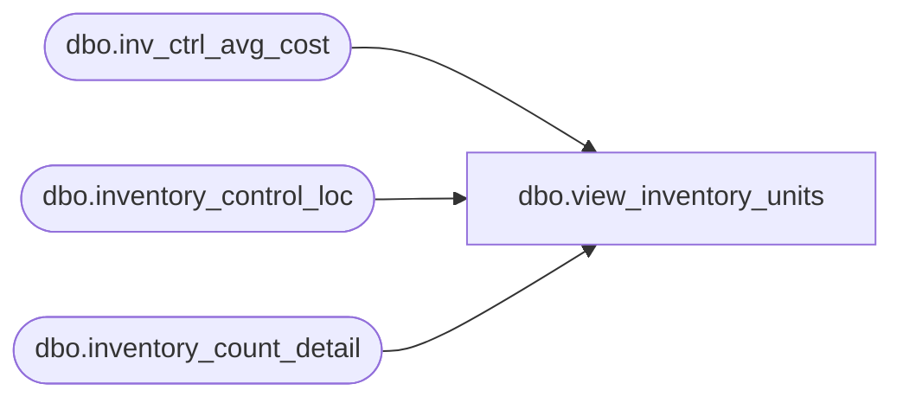

# dbo.view_inventory_units

**Database:** me_01  
**Server:** bedrockdb02  

## Architecture Diagram



## Table Dependencies

| Referenced Table |
|---|
| dbo.inv_ctrl_avg_cost |
| dbo.inventory_control_loc |
| dbo.inventory_count_detail |

## View Code

```sql
create view dbo.view_inventory_units 

(inventory_control_id,inventory_count_detail_id,sku_id,
location_id,book_qty,counted_units,shrink_units,cost,counted_cost,shrink_cost,in_transit)
as
SELECT 
icd.inventory_control_id,
icd.inventory_count_detail_id,
icd.sku_id,
icl.location_id,
icd.total_oh_book_units AS book_qty, 
ISNULL(SUM(icd.units_counted), 0) AS counted_units,
ISNULL(icd.total_oh_book_units, 0) - ISNULL(SUM(icd.units_counted), 0) AS shrink_units, 
ROUND(icd.total_oh_book_units * SUM(icag.average_cost), 2) AS cost,
ROUND(ISNULL(SUM(icd.units_counted), 0) * SUM(icag.average_cost), 2) AS counted_cost,
ROUND((ISNULL(icd.total_oh_book_units, 0) - ISNULL(SUM(icd.units_counted), 0)) * SUM(icag.average_cost), 2) AS shrink_cost,
ISNULL(icd.total_oh_in_transit_units, 0) AS in_transit
FROM dbo.inventory_count_detail icd 
INNER JOIN dbo.inventory_control_loc icl ON icd.inventory_control_loc_id = icl.inventory_control_loc_id
INNER JOIN dbo.inv_ctrl_avg_cost icag ON icd.inventory_control_id = icag.inventory_control_id AND icd.sku_id = icag.sku_id AND icl.location_id = icag.location_id
GROUP BY 
icd.inventory_control_id,
icd.inventory_count_detail_id,
icd.sku_id,
icl.location_id,
icd.total_oh_book_units,
icd.total_oh_book_cost, 
ISNULL(icd.total_oh_in_transit_units, 0)
```

