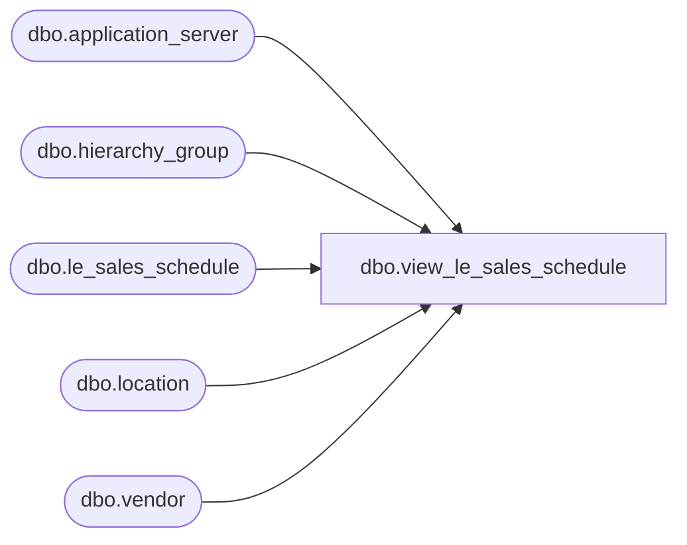

# dbo.view_le_sales_schedule

**Database:** me_01  
**Server:** bedrockdb02  

## Architecture Diagram



## Table Dependencies

| Referenced Table |
|---|
| dbo.application_server |
| dbo.hierarchy_group |
| dbo.le_sales_schedule |
| dbo.location |
| dbo.vendor |

## View Code

```sql
create view dbo.view_le_sales_schedule  AS
(SELECT DISTINCT
 f.hierarchy_group_id,
 h.hierarchy_group_code,
 h.hierarchy_group_short_label,
 h.hierarchy_group_label, 
 f.vendor_id,
 v.vendor_code,
 v.vendor_name,
 f.location_id,
 l.location_code,
 l.location_short_name,
 l.location_name,
 f.run_on_sunday,
 f.run_on_monday,
 f.run_on_tuesday,
 f.run_on_wednesday,
 f.run_on_thursday,
 f.run_on_friday,
 f.run_on_saturday,
 f.cycle_frequency,
 convert(smalldatetime,convert(char(12),
 f.last_run_date,109))last_run_date,
 f.cycle_period,
 convert(smalldatetime,convert(char(12),
 f.next_run_date,109))next_run_date,
 ap.server_name,
 f.no_prior_weeks
 FROM le_sales_schedule f
 INNER JOIN hierarchy_group h
 ON f.hierarchy_group_id = h.hierarchy_group_id
 INNER JOIN application_server ap
 ON f.application_server_id = ap.application_server_id
 LEFT OUTER JOIN vendor v
 ON f.vendor_id = v.vendor_id
 LEFT OUTER JOIN location l
 ON f.location_id = l.location_id
)
```

