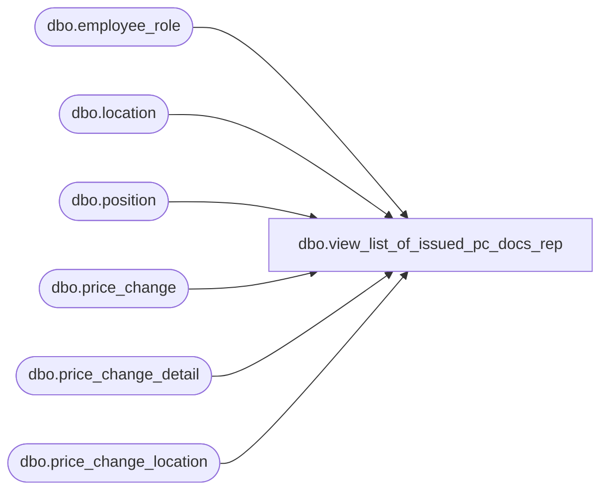

# dbo.view_list_of_issued_pc_docs_rep

**Database:** me_01  
**Server:** bedrockdb02  

## Architecture Diagram



## Table Dependencies

| Referenced Table |
|---|
| dbo.employee_role |
| dbo.location |
| dbo.position |
| dbo.price_change |
| dbo.price_change_detail |
| dbo.price_change_location |

## View Code

```sql
CREATE VIEW [dbo].[view_list_of_issued_pc_docs_rep] AS

--sql for old price change docs
SELECT        loc.location_id, loc.location_code, loc.location_name, pc.price_change_no, pc.price_change_description, pc.price_change_duration, pc.price_change_type, pos.position_label,
                         emprol.role_label, pos.position_code, pc.issue_date, pc.effective_from_date, pc.effective_to_date, pcloc.printed_status, pc.price_change_id
FROM            price_change AS pc WITH (NOLOCK) INNER JOIN
                         position AS pos WITH (NOLOCK) ON pc.position_id = pos.position_id INNER JOIN
                         price_change_location AS pcloc WITH (NOLOCK) ON pc.price_change_id = pcloc.price_change_id INNER JOIN
                         employee_role AS emprol WITH (NOLOCK) ON pos.employee_role_id = emprol.employee_role_id AND pos.employee_role_id = emprol.employee_role_id INNER JOIN
                         location AS loc WITH (NOLOCK) ON pcloc.location_id = loc.location_id
WHERE        (pc.price_change_status = 3)
UNION ALL

--and for new price change docs.  printed status not supported here.
SELECT
                         loc.location_id, loc.location_code, loc.location_name, pc.price_change_no, pc.price_change_description, pc.price_change_duration, pc.price_change_type, pos.position_label,
                         emprol.role_label, pos.position_code, pc.issue_date, pc.effective_from_date, pc.effective_to_date, 0 AS printed_status, pc.price_change_id
FROM            price_change AS pc WITH (NOLOCK) INNER JOIN
                         position AS pos WITH (NOLOCK) ON pc.position_id = pos.position_id INNER JOIN
                         (select distinct price_change_id, location_id from price_change_detail with (nolock) where is_pseudo_instruction=0) AS pcdet ON pc.price_change_id = pcdet.price_change_id INNER JOIN
                         employee_role AS emprol WITH (NOLOCK) ON pos.employee_role_id = emprol.employee_role_id AND pos.employee_role_id = emprol.employee_role_id INNER JOIN
                         location AS loc WITH (NOLOCK) ON pcdet.location_id = loc.location_id
WHERE        (pc.price_change_status = 3)
```

