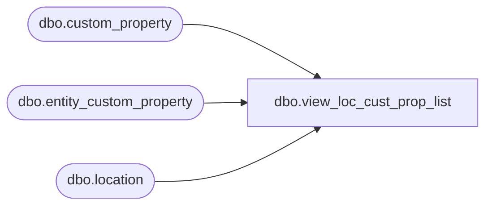

# dbo.view_loc_cust_prop_list

**Database:** me_01  
**Server:** bedrockdb02  

## Architecture Diagram



## Table Dependencies

| Referenced Table |
|---|
| dbo.custom_property |
| dbo.entity_custom_property |
| dbo.location |

## View Code

```sql
create view dbo.view_loc_cust_prop_list AS
SELECT DISTINCT
  a.location_id,   
  e.custom_property_value,   
  e.custom_property_id, 
  b.cust_prop_code,
  b.cust_prop_label
FROM entity_custom_property e
RIGHT OUTER JOIN location a 
ON a.location_id =e.parent_id and e.parent_type =2
LEFT  OUTER JOIN custom_property b 
ON e.custom_property_id = b.custom_property_id
```

