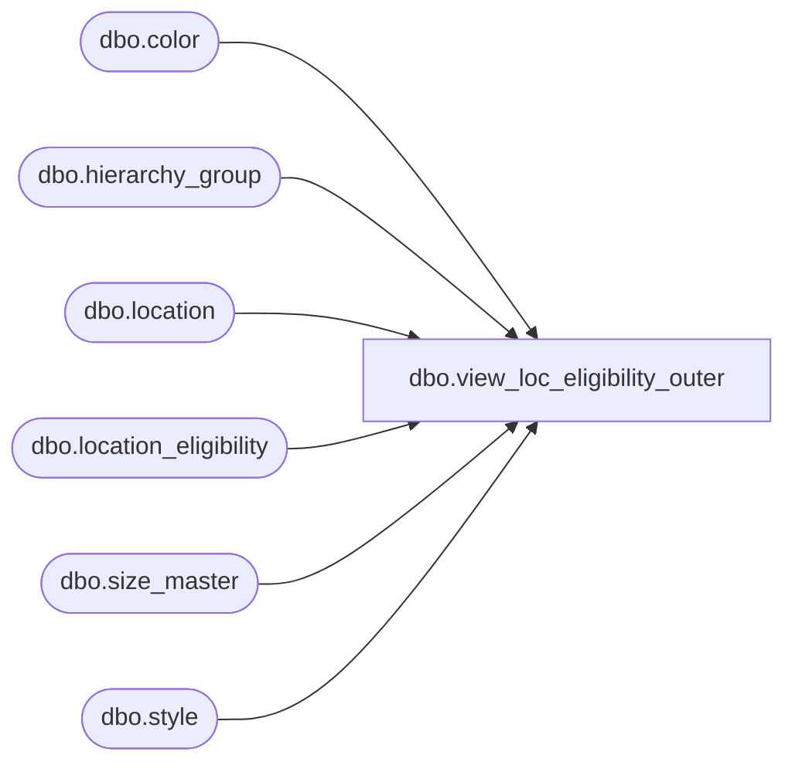

# dbo.view_loc_eligibility_outer

**Database:** me_01  
**Server:** bedrockdb02  

## Architecture Diagram



## Table Dependencies

| Referenced Table |
|---|
| dbo.color |
| dbo.hierarchy_group |
| dbo.location |
| dbo.location_eligibility |
| dbo.size_master |
| dbo.style |

## View Code

```sql
create view dbo.view_loc_eligibility_outer AS
select distinct le.location_id ,
le.style_id, s.style_code ,s.short_desc, s.long_desc, le.hierarchy_group_id, h.hierarchy_group_code,
h.hierarchy_group_short_label, h.hierarchy_group_label, eligibility_flag,  le.color_id, c.color_code, c.color_short_description ,
 c. color_long_description,le.size_master_id,z.size_code,z.prim_size_label,z.sec_size_label
 FROM location_eligibility le left JOIN location l
on  le.location_id =l.location_id 
LEFT JOIN style s
on le.style_id = s.style_id
LEFT JOIN hierarchy_group h
on le.hierarchy_group_id =h.hierarchy_group_id 
LEFT JOIN size_master z
on le.size_master_id = z.size_master_id
LEFT JOIN color c
on le.color_id = c.color_id
```

