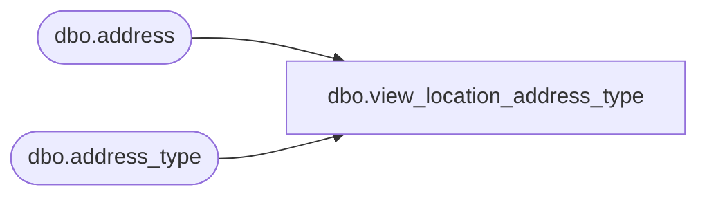

# dbo.view_location_address_type

**Database:** me_01  
**Server:** bedrockdb02  

## Architecture Diagram



## Table Dependencies

| Referenced Table |
|---|
| dbo.address |
| dbo.address_type |

## View Code

```sql
create view dbo.view_location_address_type AS
select distinct ad.address_type_id, address_type_description from address_type ad , address a
where ad.address_type_id = a.address_type_id 
and a.parent_type = 2
```

