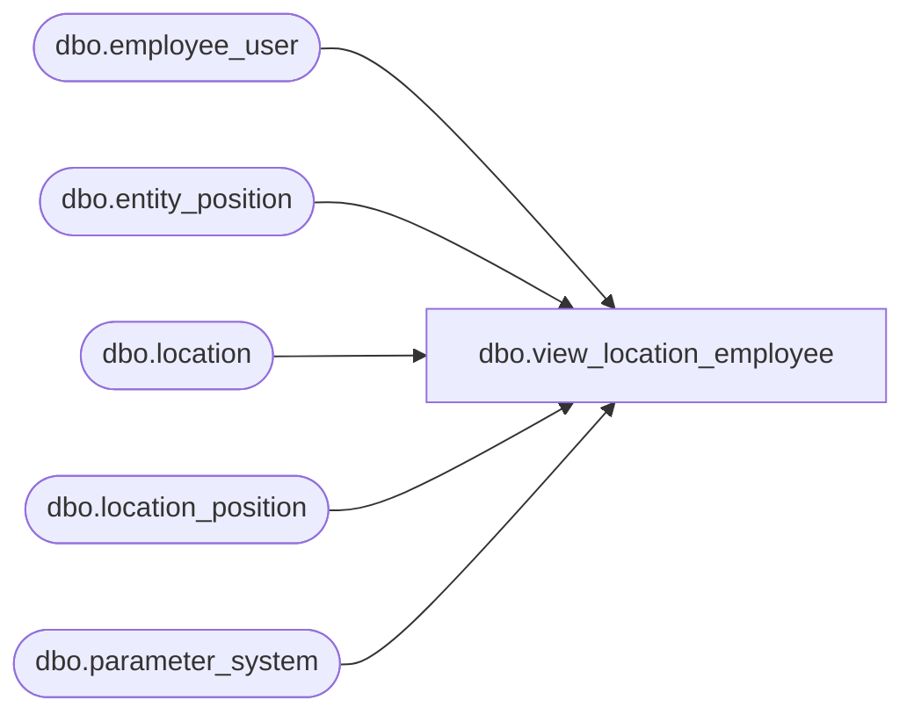

# dbo.view_location_employee

**Database:** me_01  
**Server:** bedrockdb02  

## Architecture Diagram



## Table Dependencies

| Referenced Table |
|---|
| dbo.employee_user |
| dbo.entity_position |
| dbo.location |
| dbo.location_position |
| dbo.parameter_system |

## View Code

```sql
CREATE  VIEW [dbo].view_location_employee
AS

SELECT location_id, u.[USER_ID] AS [user_id] FROM location WITH (NOLOCK), employee_user u WITH (NOLOCK)
  CROSS JOIN parameter_system WHERE restrict_by_employee_pos_flag=0

UNION ALL

SELECT  loc_ep.location_id, emp_ep.parent_id as [user_id]
FROM
  location_position loc_ep WITH (NOLOCK)
  INNER JOIN dbo.entity_position emp_ep WITH (NOLOCK) ON emp_ep.position_id=loc_ep.position_id
  CROSS JOIN parameter_system ps WITH (NOLOCK)
  WHERE ps.restrict_by_employee_pos_flag=1 AND
    emp_ep.parent_type = 4 -- employee
```

