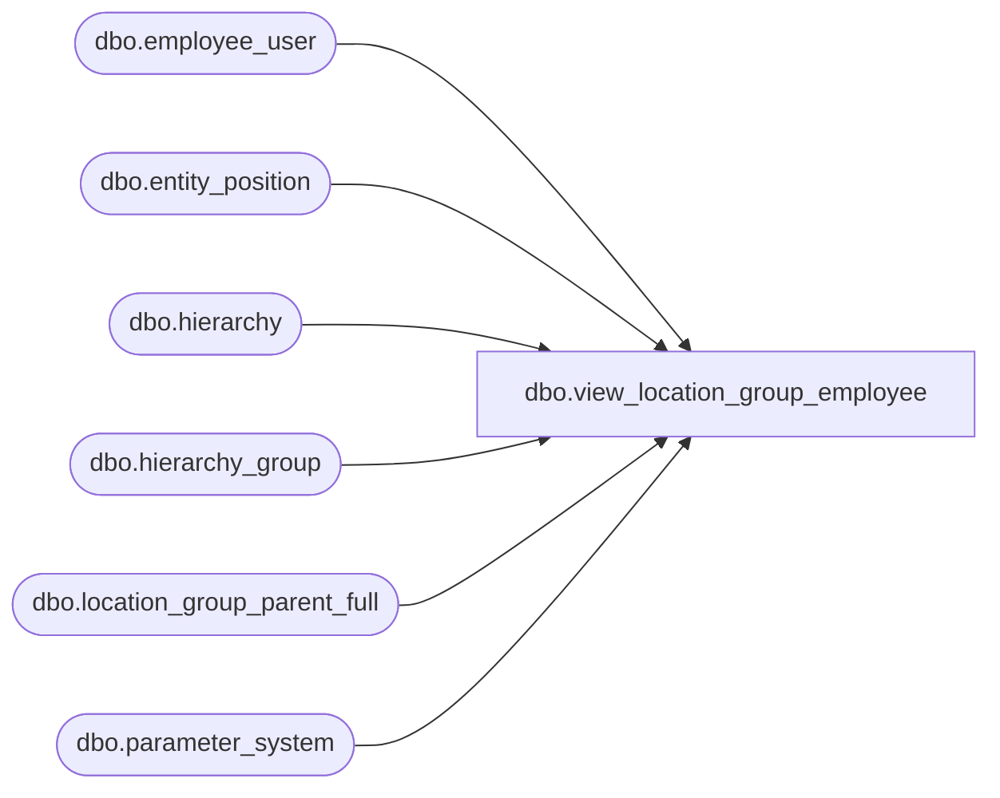

# dbo.view_location_group_employee

**Database:** me_01  
**Server:** bedrockdb02  

## Architecture Diagram



## Table Dependencies

| Referenced Table |
|---|
| dbo.employee_user |
| dbo.entity_position |
| dbo.hierarchy |
| dbo.hierarchy_group |
| dbo.location_group_parent_full |
| dbo.parameter_system |

## View Code

```sql
CREATE  VIEW [dbo].[view_location_group_employee]
AS

 -- users have access to all groups in alternate hierarchies
SELECT hierarchy_group_id, u.[USER_ID] AS [user_id]
 FROM hierarchy_group hg
 INNER JOIN hierarchy h on hg.hierarchy_id = h.hierarchy_id and h.hierarchy_type = 2 and h.alternate_flag=1
 CROSS JOIN employee_user u WITH (NOLOCK)

UNION ALL

-- users have access to all groups in main hierarchies when restrict_by_employee_pos_flag=0
SELECT hierarchy_group_id, u.[USER_ID] AS [user_id]
 FROM hierarchy_group hg
 INNER JOIN hierarchy h on hg.hierarchy_id = h.hierarchy_id and h.hierarchy_type = 2 and h.alternate_flag=0
 CROSS JOIN employee_user u WITH (NOLOCK)
 CROSS JOIN parameter_system ps WITH (NOLOCK)
  WHERE ps.restrict_by_employee_pos_flag=0

UNION ALL

-- users have access to groups by position in main hierarchies when restrict_by_employee_pos_flag=1
SELECT DISTINCT LGPF.hierarchy_group_id, emp_ep.parent_id as [user_id]
FROM
  location_group_parent_full LGPF WITH (NOLOCK)
  INNER JOIN entity_position EP on EP.parent_type=5 and EP.parent_id=LGPF.parent_hierarchy_group_id
  INNER JOIN dbo.entity_position emp_ep WITH (NOLOCK) ON emp_ep.position_id=EP.position_id
  CROSS JOIN parameter_system ps WITH (NOLOCK)
  WHERE ps.restrict_by_employee_pos_flag=1 AND
    emp_ep.parent_type = 4 -- employee
```

