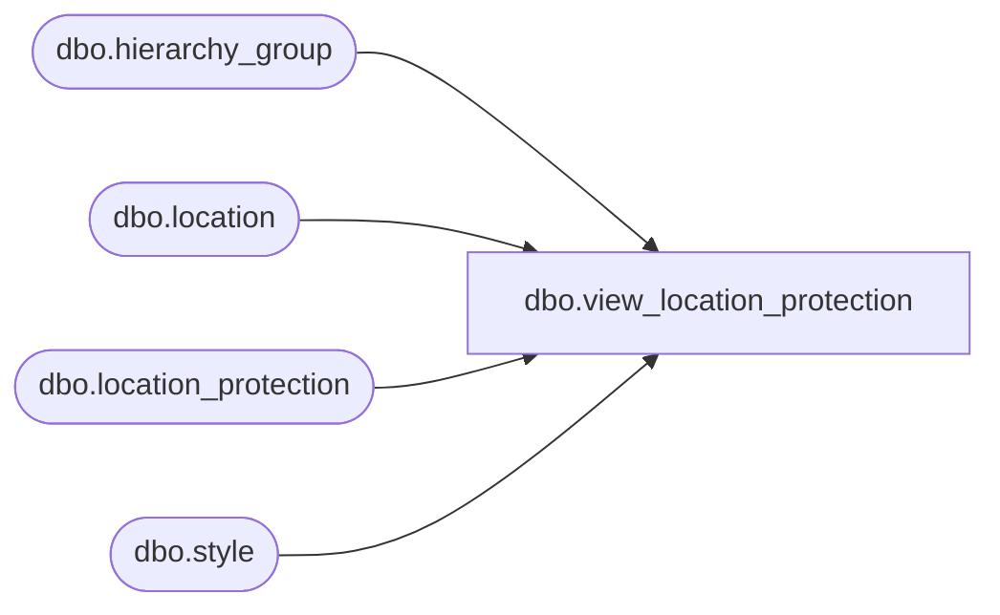

# dbo.view_location_protection

**Database:** me_01  
**Server:** bedrockdb02  

## Architecture Diagram



## Table Dependencies

| Referenced Table |
|---|
| dbo.hierarchy_group |
| dbo.location |
| dbo.location_protection |
| dbo.style |

## View Code

```sql
create view dbo.view_location_protection as
select lp.location_id, l.location_code,l.location_name,l.location_short_name,lp.hierarchy_group_id,h.hierarchy_group_code, h.hierarchy_group_label,
h.hierarchy_group_short_label, NULL style_id, NULL style_code, NULL long_desc,
NULL short_desc, lp.protection_level,lp.effective_end_date ,lp.effective_begin_date
from location_protection lp
 inner join hierarchy_group h
 on lp.hierarchy_group_id = h.hierarchy_group_id
inner join location l
on lp.location_id =l.location_id
union all
select   lp.location_id, l.location_code,l.location_name,l.location_short_name,NULL hierarchy_group_id,NULL hierarchy_group_code, NULL hierarchy_group_label,
NULL hierarchy_group_short_label, lp.style_id,s.style_code, s.long_desc,
s.short_desc,lp.protection_level, lp.effective_end_date, lp.effective_begin_date
from location_protection lp
 inner join style s
 on lp.style_id = s.style_id
inner join location l
on lp.location_id =l.location_id
```

