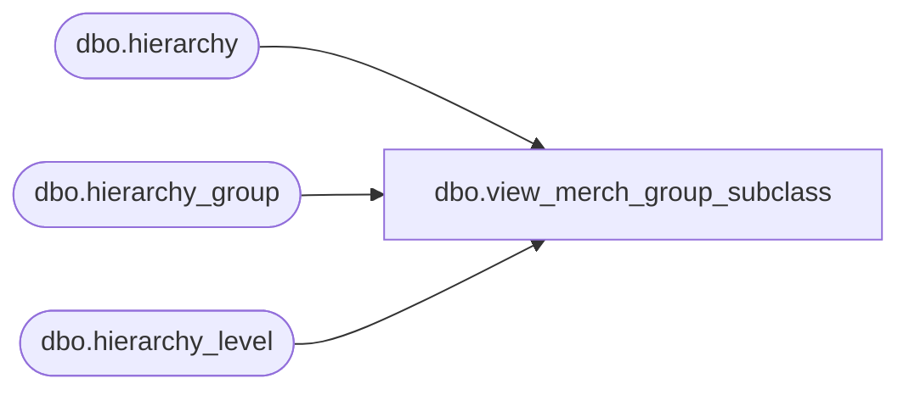

# dbo.view_merch_group_subclass

**Database:** me_01  
**Server:** bedrockdb02  

## Architecture Diagram



## Table Dependencies

| Referenced Table |
|---|
| dbo.hierarchy |
| dbo.hierarchy_group |
| dbo.hierarchy_level |

## View Code

```sql
create view [view_merch_group_subclass] 
AS
SELECT DISTINCT hg.hierarchy_group_id, hg.hierarchy_level_id, hg.hierarchy_group_code, hg.hierarchy_group_label, hg.hierarchy_group_short_label  
FROM hierarchy_group hg, hierarchy h 
WHERE h.hierarchy_id = hg.hierarchy_id AND h.hierarchy_type = 1 
AND hg.hierarchy_level_id IN  (SELECT hierarchy_level_id  
			FROM hierarchy_level  
			WHERE hierarchy_level_id NOT IN  (SELECT p.hierarchy_level_id												FROM hierarchy_level p, hierarchy_level c  
							WHERE p.hierarchy_level_id = c.parent_level_id) )
```

