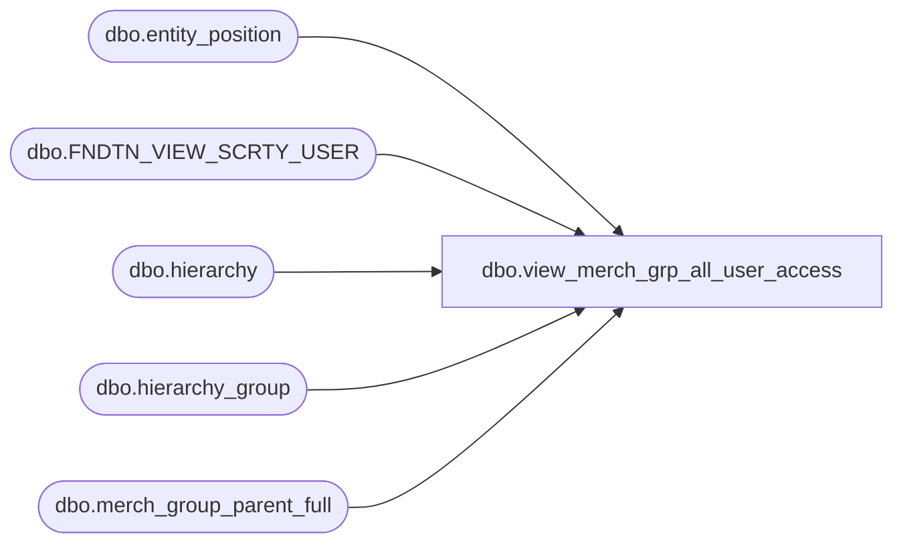

# dbo.view_merch_grp_all_user_access

**Database:** me_01  
**Server:** bedrockdb02  

## Architecture Diagram



## Table Dependencies

| Referenced Table |
|---|
| dbo.entity_position |
| dbo.FNDTN_VIEW_SCRTY_USER |
| dbo.hierarchy |
| dbo.hierarchy_group |
| dbo.merch_group_parent_full |

## View Code

```sql
CREATE VIEW dbo.view_merch_grp_all_user_access AS
SELECT mgpf.hierarchy_group_id, epe.position_id, e.USER_ID 
FROM entity_position epe, FNDTN_VIEW_SCRTY_USER e, entity_position epg, merch_group_parent_full mgpf
WHERE e.USER_ID = epe.parent_id 
AND epe.parent_type = 4
AND epe.position_id = epg.position_id
AND epg.parent_type = 5 
AND epg.parent_id = mgpf.parent_hierarchy_group_id
UNION ALL
SELECT hierarchy_group_id, null, fvsu.USER_ID 
FROM hierarchy_group hg, hierarchy h, FNDTN_VIEW_SCRTY_USER fvsu
WHERE hg.hierarchy_id = h.hierarchy_id 
AND h.hierarchy_type = 1
AND h.alternate_flag = 1
```

