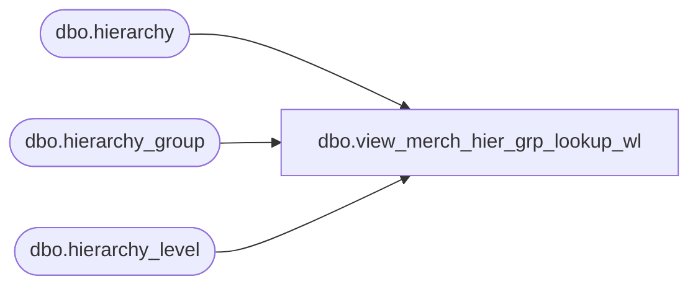

# dbo.view_merch_hier_grp_lookup_wl

**Database:** me_01  
**Server:** bedrockdb02  

## Architecture Diagram



## Table Dependencies

| Referenced Table |
|---|
| dbo.hierarchy |
| dbo.hierarchy_group |
| dbo.hierarchy_level |

## View Code

```sql
CREATE  VIEW [dbo].view_merch_hier_grp_lookup_wl
AS

SELECT hierarchy_level_label + N' - ' + hierarchy_group_label 'hierarchy_group_label', hierarchy_group_code, hg.hierarchy_group_id
FROM hierarchy h
INNER JOIN hierarchy_level hl ON (h.hierarchy_id = hl.hierarchy_id)
INNER JOIN hierarchy_group hg ON (hg.hierarchy_id = h.hierarchy_id AND hg.hierarchy_level_id = hl.hierarchy_level_id)
WHERE h.hierarchy_type = 1
GROUP BY hierarchy_level_label, hierarchy_group_label, hierarchy_group_code, hg.hierarchy_group_id
```

