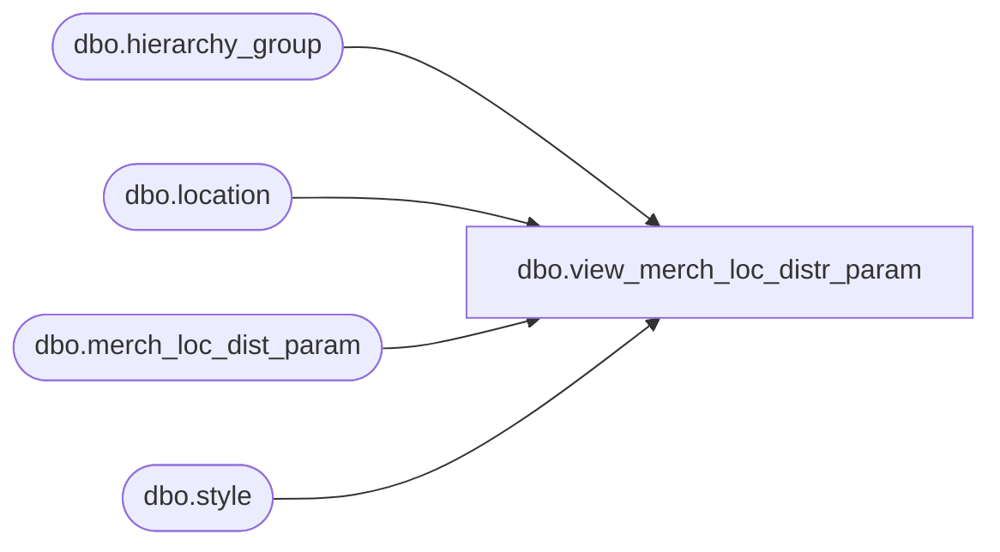

# dbo.view_merch_loc_distr_param

**Database:** me_01  
**Server:** bedrockdb02  

## Architecture Diagram



## Table Dependencies

| Referenced Table |
|---|
| dbo.hierarchy_group |
| dbo.location |
| dbo.merch_loc_dist_param |
| dbo.style |

## View Code

```sql
create view dbo.view_merch_loc_distr_param as
select mldp.warehouse_id, w.location_code warehouse_code, w.location_name warehouse_name,
 w.location_short_name warehouse_short_name,
 mldp.location_id, l.location_code,l.location_name,l.location_short_name,
mldp.hierarchy_group_id,h.hierarchy_group_code, h.hierarchy_group_label,
h.hierarchy_group_short_label, NULL style_id, NULL style_code, NULL long_desc,
NULL short_desc, mldp.location_lead_time
from merch_loc_dist_param mldp
 inner join hierarchy_group h
 on mldp.hierarchy_group_id = h.hierarchy_group_id
inner join location l
on mldp.location_id =l.location_id
inner join location w
on mldp.warehouse_id = w.location_id
union all
select  mldp.warehouse_id, w.location_code warehouse_code, w.location_name warehouse_name,
 w.location_short_name warehouse_short_name,
 mldp.location_id, l.location_code,l.location_name,l.location_short_name,
NULL hierarchy_group_id,NULL hierarchy_group_code, NULL hierarchy_group_label,
NULL hierarchy_group_short_label, mldp.style_id,s.style_code, s.long_desc,
s.short_desc,mldp.location_lead_time
from merch_loc_dist_param mldp
 inner join style s
 on mldp.style_id = s.style_id
inner join location l
on mldp.location_id =l.location_id
inner join location w
on mldp.warehouse_id = w.location_id
```

