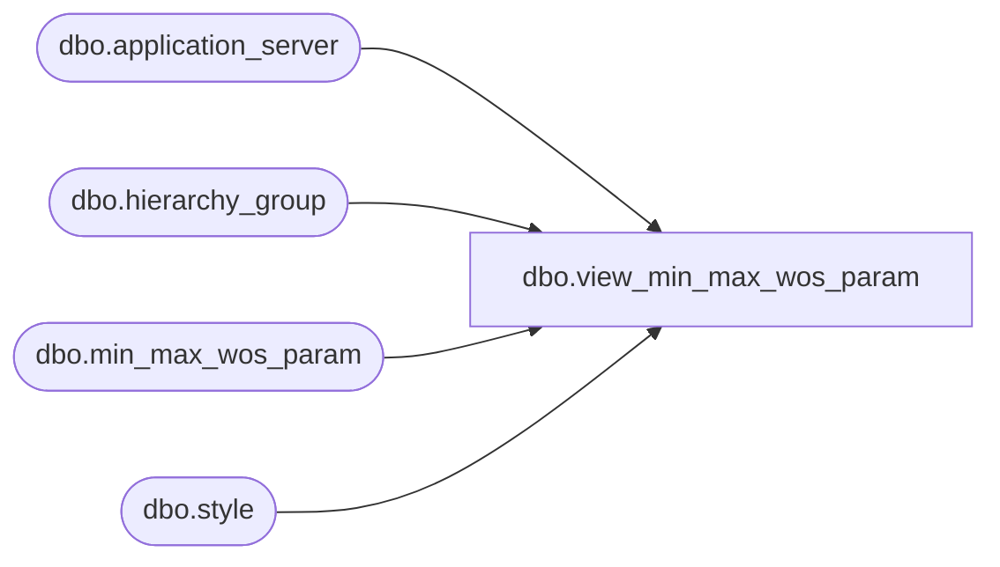

# dbo.view_min_max_wos_param

**Database:** me_01  
**Server:** bedrockdb02  

## Architecture Diagram



## Table Dependencies

| Referenced Table |
|---|
| dbo.application_server |
| dbo.hierarchy_group |
| dbo.min_max_wos_param |
| dbo.style |

## View Code

```sql
create view dbo.view_min_max_wos_param  AS
(SELECT DISTINCT
 mm.min_max_wos_param_id,
 NULL hierarchy_group_id,
 NULL hierarchy_group_code,
 NULL hierarchy_group_short_label,
 NULL hierarchy_group_label,
 mm.style_id,
 s.style_code,
 s.short_desc,
 s.long_desc,
 mm.review_on_sunday,
 mm.review_on_monday,
 mm.review_on_tuesday,
 mm.review_on_wednesday,
 mm.review_on_thursday,
 mm.review_on_friday,
 mm.review_on_saturday,
 mm.cycle_frequency,
 convert(smalldatetime,convert(char(12),
 mm.last_execution,109))last_execution,
 mm.last_number_of_weeks,
 mm.minimum_weeks_of_supply,
 mm.maximum_weeks_of_supply,
 mm.process_level,
 mm.last_activity_date,
 mm.cycle_period,
 convert(smalldatetime,convert(char(12),
 mm.next_execution,109))next_execution,
 mm.use_seasonality,
 ap.server_name
 FROM min_max_wos_param mm
INNER JOIN style s
ON mm.style_id = s.style_id
 INNER JOIN application_server ap
 ON mm.application_server_id = ap.application_server_id
)
UNION ALL
(SELECT DISTINCT
 mm.min_max_wos_param_id,
 mm.hierarchy_group_id,
 h.hierarchy_group_code,
 h.hierarchy_group_short_label,
 h.hierarchy_group_label, 
 NULL style_id,
 NULL style_code,
 NULL short_desc,
 NULL long_desc,
 mm.review_on_sunday,
 mm.review_on_monday,
 mm.review_on_tuesday,
 mm.review_on_wednesday,
 mm.review_on_thursday,
 mm.review_on_friday,
 mm.review_on_saturday,
 mm.cycle_frequency,
 convert(smalldatetime,convert(char(12),
 mm.last_execution,109))last_execution,
 mm.last_number_of_weeks,
 mm.minimum_weeks_of_supply,
 mm.maximum_weeks_of_supply,
 mm.process_level,
 mm.last_activity_date,
 mm.cycle_period,
 convert(smalldatetime,convert(char(12),
 mm.next_execution,109))next_execution,
 mm.use_seasonality,
 ap.server_name
 FROM min_max_wos_param mm 
 INNER JOIN hierarchy_group h
 ON mm.hierarchy_group_id = h.hierarchy_group_id
 INNER JOIN application_server ap
 ON mm.application_server_id = ap.application_server_id
)
```

