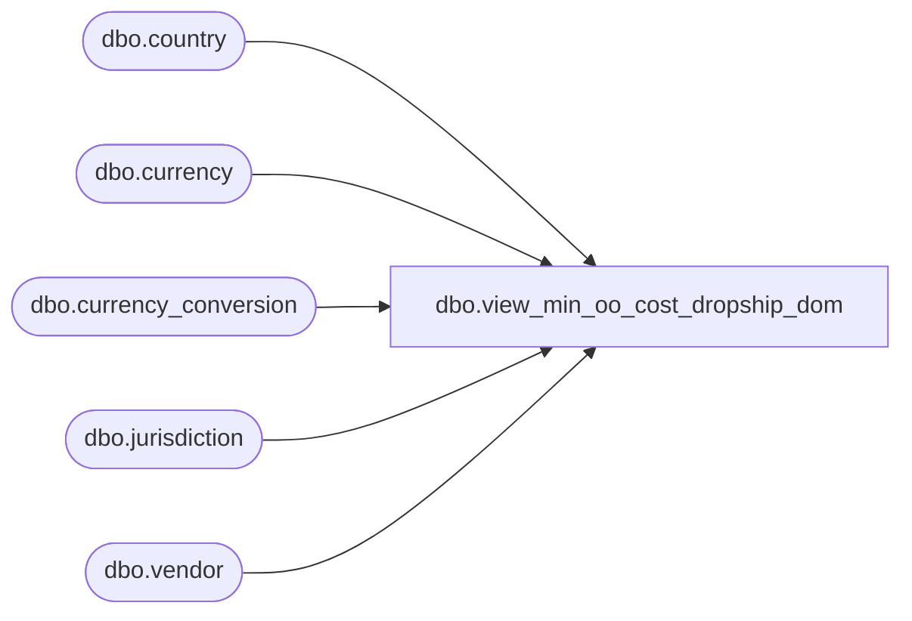

# dbo.view_min_oo_cost_dropship_dom

**Database:** me_01  
**Server:** bedrockdb02  

## Architecture Diagram



## Table Dependencies

| Referenced Table |
|---|
| dbo.country |
| dbo.currency |
| dbo.currency_conversion |
| dbo.jurisdiction |
| dbo.vendor |

## View Code

```sql
CREATE  VIEW [dbo].[view_min_oo_cost_dropship_dom] AS
select vendor_id, min_on_order_cost_dropship, ROUND (min_on_order_cost_dropship *
(SELECT cc.exchange_rate FROM currency c, currency_conversion cc, country co, jurisdiction j 
WHERE co.country_id = j.country_id 
AND c.currency_id = co.currency_id 
AND cc.from_currency_id = co.currency_id 
AND cc.to_currency_id = vendor.currency_id
AND cc.currency_conversion_type = 1 
AND j.home_jurisdiction_flag = 1 
AND (effective_from_date  <= (select getdate()) OR effective_from_date IS NULL) 
AND (effective_to_date >= (select getdate()) OR effective_to_date IS NULL)   
), 2 ) as min_on_order_cost_dropship_dom from vendor
```

