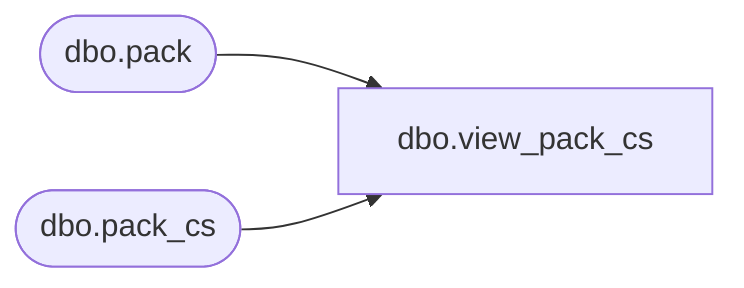

# dbo.view_pack_cs

**Database:** me_01  
**Server:** bedrockdb02  

## Architecture Diagram



## Table Dependencies

| Referenced Table |
|---|
| dbo.pack |
| dbo.pack_cs |

## View Code

```sql
create view [view_pack_cs] 
AS
SELECT [pack_id]
      ,[pack_code]
      ,[pack_description]
      ,[pack_short_description]
      ,[pack_status]
      ,[pack_type]
      ,[style_id]
      ,[vendor_id]
      ,[vendor_pack_code]
      ,[vendor_upc_flag]
      ,[active_flag]
      ,[updatestamp]
      ,[last_item_id]
      ,[multi_color_flag]
      ,[bin_location]
      ,[document_source]
      ,[export_status]
  FROM [pack]
UNION ALL
SELECT [pack_id]
      ,[pack_code]
      ,[pack_description]
      ,[pack_short_description]
      ,[pack_status]
      ,[pack_type]
      ,[style_id]
      ,[vendor_id]
      ,[vendor_pack_code]
      ,[vendor_upc_flag]
      ,[active_flag]
      ,[updatestamp]
      ,[last_item_id]
      ,[multi_color_flag]
      ,[bin_location]
      ,[document_source]
      ,[export_status]
  FROM [pack_cs]
```

