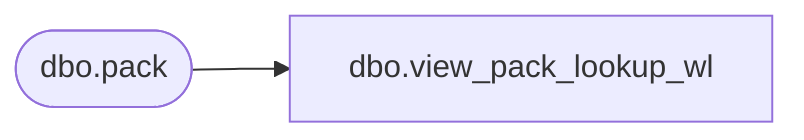

# dbo.view_pack_lookup_wl

**Database:** me_01  
**Server:** bedrockdb02  

## Architecture Diagram



## Table Dependencies

| Referenced Table |
|---|
| dbo.pack |

## View Code

```sql
create view dbo.view_pack_lookup_wl 
AS
SELECT pack_id, pack_code + N' - ' + pack_description 'pack_label'
FROM pack
WHERE active_flag = 1
```

