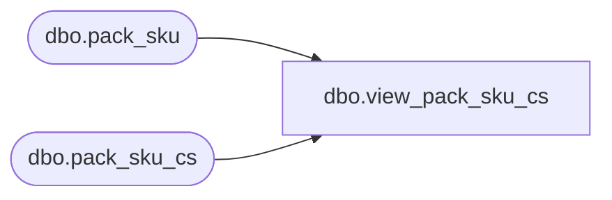

# dbo.view_pack_sku_cs

**Database:** me_01  
**Server:** bedrockdb02  

## Architecture Diagram



## Table Dependencies

| Referenced Table |
|---|
| dbo.pack_sku |
| dbo.pack_sku_cs |

## View Code

```sql
create view [view_pack_sku_cs] 
AS
SELECT [pack_sku_id]
      ,[pack_id]
      ,[sku_id]
      ,[sku_quantity]
  FROM [pack_sku]
UNION ALL
SELECT [pack_sku_id]
      ,[pack_id]
      ,[sku_id]
      ,[sku_quantity]
  FROM [pack_sku_cs]
```

