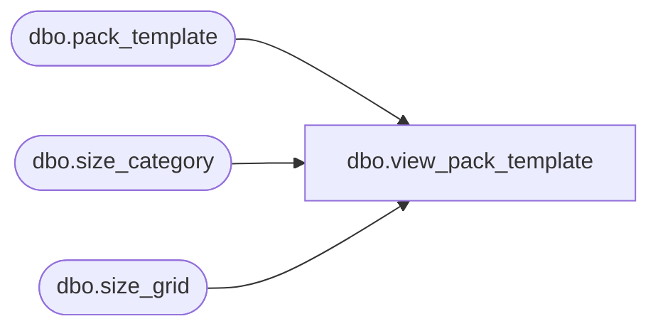

# dbo.view_pack_template

**Database:** me_01  
**Server:** bedrockdb02  

## Architecture Diagram



## Table Dependencies

| Referenced Table |
|---|
| dbo.pack_template |
| dbo.size_category |
| dbo.size_grid |

## View Code

```sql
create view [view_pack_template] 
AS
SELECT pt.template_code, pt.long_description, pt.short_description, pt.size_category_id,
c.size_category_code, c.size_category_label, g.size_grid_id, COALESCE(g.size_grid_code, N'') AS size_grid_code, COALESCE(g.size_grid_desc, N'') AS size_grid_desc,
pt.color_count, pt.total_template_quantity
FROM pack_template pt
INNER JOIN size_category c ON pt.size_category_id = c.size_category_id
LEFT OUTER JOIN size_grid g ON pt.size_grid_id = g.size_grid_id
```

