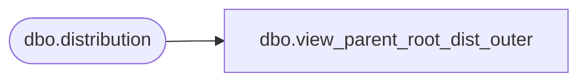

# dbo.view_parent_root_dist_outer

**Database:** me_01  
**Server:** bedrockdb02  

## Architecture Diagram



## Table Dependencies

| Referenced Table |
|---|
| dbo.distribution |

## View Code

```sql
create view dbo.view_parent_root_dist_outer AS
SELECT d.distribution_id,  d.parent_distribution_id,{fn IFNULL(dp.distribution_number , N'')} parent_distribution_number,d.root_distribution_id,{fn IFNULL(dr.distribution_number , N'')} root_distribution_number
FROM distribution d
LEFT JOIN distribution dp
ON d.parent_distribution_id = dp.distribution_id
LEFT JOIN distribution dr
ON d.root_distribution_id = dr.distribution_id
```

