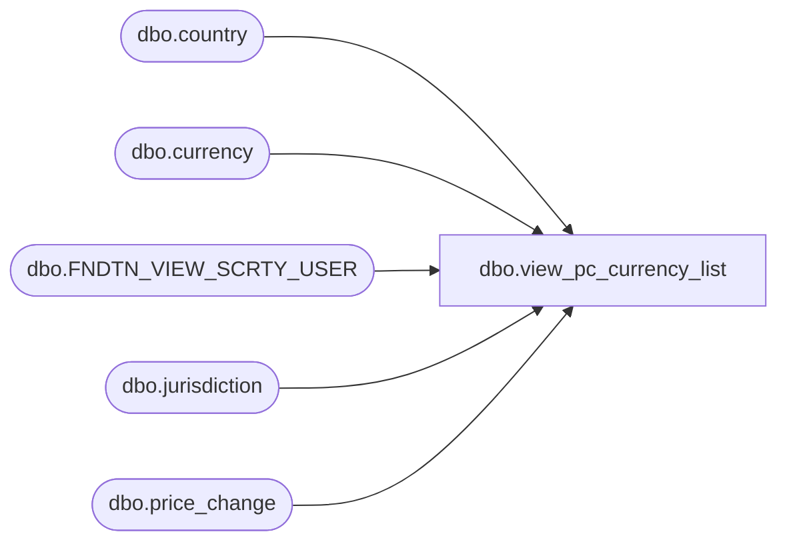

# dbo.view_pc_currency_list

**Database:** me_01  
**Server:** bedrockdb02  

## Architecture Diagram



## Table Dependencies

| Referenced Table |
|---|
| dbo.country |
| dbo.currency |
| dbo.FNDTN_VIEW_SCRTY_USER |
| dbo.jurisdiction |
| dbo.price_change |

## View Code

```sql
Create view [dbo].[view_pc_currency_list]

AS
SELECT DISTINCT price_change_id, COALESCE(c2.currency_code, c.currency_code) AS pc_currency_code, cval.currency_code, COALESCE(c2.currency_id, c.currency_id) AS pc_currency_id, cval.currency_id
FROM price_change inner join jurisdiction j on price_change.jurisdiction_id = j.jurisdiction_id
INNER JOIN country INNER JOIN currency c ON (country.currency_id = c.currency_id) ON (j.country_id = country.country_id)
LEFT OUTER JOIN currency c2 ON c2.currency_id = price_change.total_cost_currency_id
LEFT OUTER JOIN jurisdiction homej INNER JOIN country cc INNER JOIN currency cval ON (cc.currency_id = cval.currency_id) ON (homej.country_id = cc.country_id) ON (homej.home_jurisdiction_flag = 1)
LEFT OUTER JOIN FNDTN_VIEW_SCRTY_USER employee
ON (submitted_by_id = employee.USER_ID)
```

