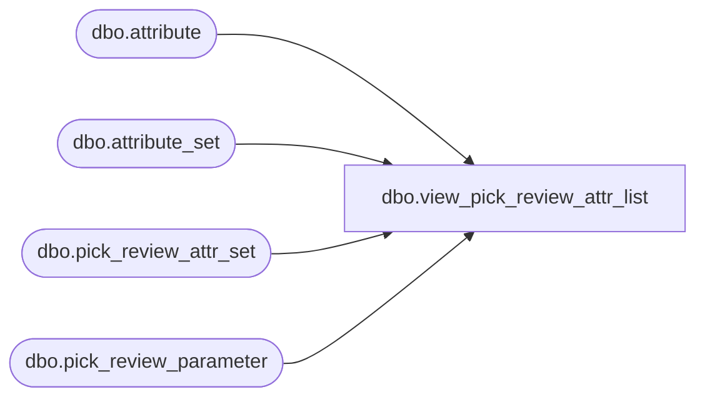

# dbo.view_pick_review_attr_list

**Database:** me_01  
**Server:** bedrockdb02  

## Architecture Diagram



## Table Dependencies

| Referenced Table |
|---|
| dbo.attribute |
| dbo.attribute_set |
| dbo.pick_review_attr_set |
| dbo.pick_review_parameter |

## View Code

```sql
create view dbo.view_pick_review_attr_list AS
 SELECT DISTINCT prp.pick_review_parameter_id,  
		     prp.merchandise_hierarchy_group_id,
                     prp.style_id,
                     prp.warehouse_id,
                     pas.attribute_set_id,
                     ats.attribute_set_code, 
                     ats.attribute_set_label, 
                     a.attribute_id,
                     a.attribute_code,
                     a.attribute_label                    
 FROM pick_review_parameter prp
 LEFT OUTER JOIN pick_review_attr_set pas
  ON (prp.pick_review_parameter_id =pas.pick_review_parameter_id 
      and (isnull(prp.merchandise_hierarchy_group_id,-1) = isnull(pas.merchandise_hierarchy_group_id,-1))
      and (isnull(prp.style_id,-1) =isnull(pas.style_id,-1))
      and prp.warehouse_id = pas.warehouse_id)
 LEFT OUTER JOIN  attribute_set ats
  ON (ats.attribute_set_id = pas.attribute_set_id )
 LEFT OUTER JOIN attribute a
  ON (ats.attribute_id = a.attribute_id)
```

