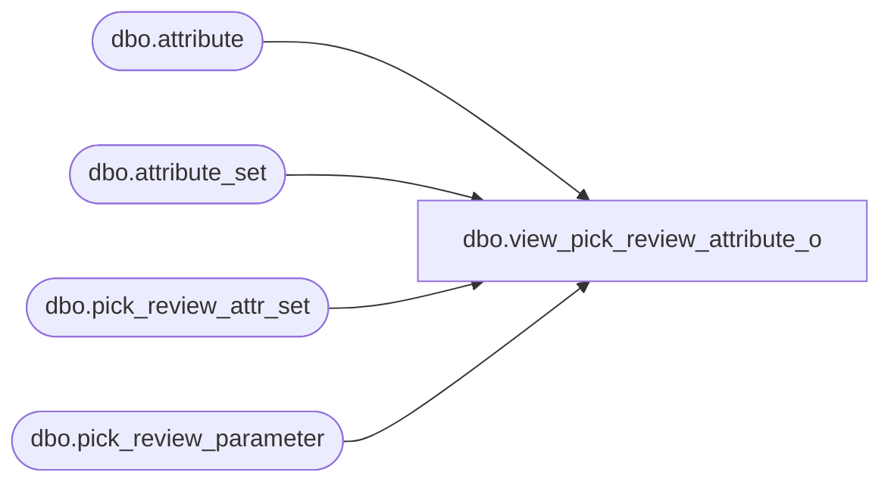

# dbo.view_pick_review_attribute_o

**Database:** me_01  
**Server:** bedrockdb02  

## Architecture Diagram



## Table Dependencies

| Referenced Table |
|---|
| dbo.attribute |
| dbo.attribute_set |
| dbo.pick_review_attr_set |
| dbo.pick_review_parameter |

## View Code

```sql
create view dbo.view_pick_review_attribute_o 
AS
SELECT g.pick_review_parameter_id,g.merchandise_hierarchy_group_id,g.style_id,
g.warehouse_id,{fn IFNULL(f.attribute_set_id,-1)}attribute_set_id,f.attribute_set_code, f.attribute_set_label,g.attribute_id,
g.attribute_code,g.attribute_label
FROM
  (  SELECT DISTINCT a.pick_review_parameter_id,  
		     a.merchandise_hierarchy_group_id,
                     a.style_id,
                     a.warehouse_id,
                     b.attribute_set_id,
                     b.attribute_set_code, 
                     b.attribute_set_label,   
                     b.attribute_id 
     FROM pick_review_attr_set e RIGHT JOIN pick_review_parameter a 
       on a.pick_review_parameter_id =e.pick_review_parameter_id
     LEFT JOIN  attribute_set b
       on e.attribute_set_id = b.attribute_set_id ) f  
     RIGHT JOIN
  (  SELECT DISTINCT  
                a.pick_review_parameter_id, 
		a.merchandise_hierarchy_group_id, 
                a.style_id,    
                a.warehouse_id,
                NULL attribute_set_code,
                e.attribute_code,
                e.attribute_label,
                e.attribute_id 
     FROM attribute e ,pick_review_parameter a
     WHERE e.parent_type=229) g
on  f.pick_review_parameter_id = g.pick_review_parameter_id
AND   (f.attribute_id = g.attribute_id
OR     f.attribute_id is NULL)
```

